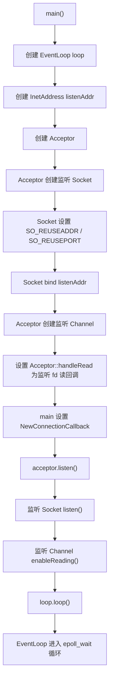
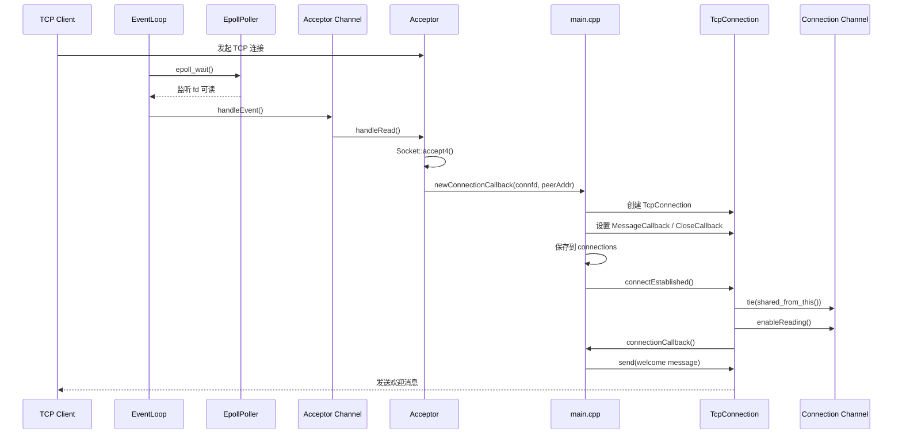
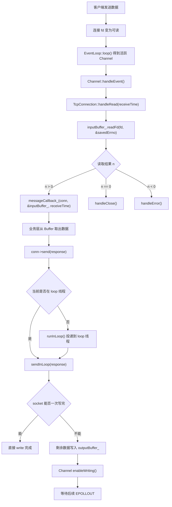
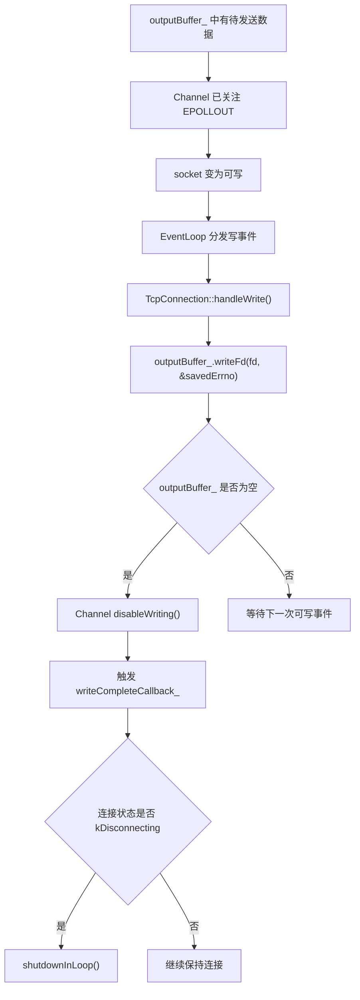
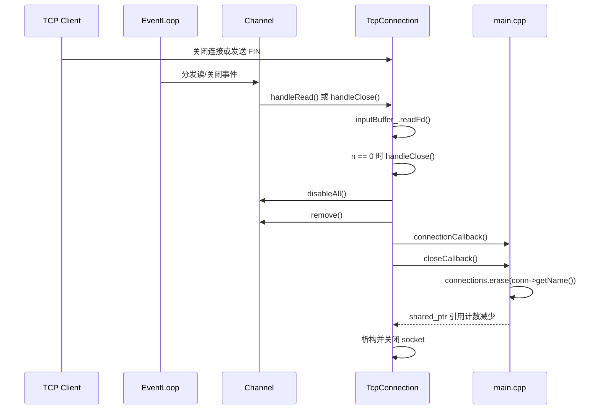
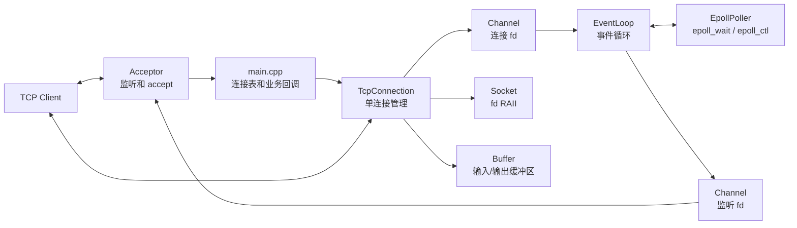

# TCP 服务器执行流程

> 本文档描述当前 demo 服务器的核心执行路径，重点说明 `EventLoop`、`Acceptor`、
> `Channel`、`TcpConnection`、`Buffer` 之间如何协作完成 TCP 连接建立、读写和关闭。

---

## 1. 当前参与模块

| 模块 | 职责 |
|---|---|
| `main.cpp` | 创建 `EventLoop` 和 `Acceptor`，保存连接对象，注册业务回调 |
| `EventLoop` | 等待 IO 事件并分发给活跃的 `Channel` |
| `Poller / EpollPoller` | 封装 `epoll_wait`、`epoll_ctl` |
| `Channel` | 保存 fd 关心的事件，并把事件分发到对应回调 |
| `Acceptor` | 监听端口，接受新连接，把已连接 fd 交给上层 |
| `TcpConnection` | 管理单条 TCP 连接的 socket、Channel、输入输出缓冲区和回调 |
| `Buffer` | 保存从 socket 读取的数据，以及暂时写不完的数据 |

---

## 2. 服务器启动流程

启动阶段的关键点：

- `Acceptor` 只负责监听 fd。
- `acceptor.listen()` 会把监听 fd 的读事件注册到 `EventLoop`。
- 真正的事件等待发生在 `EventLoop::loop()` 中。

---

## 3. 新连接建立流程

新连接阶段的关键点：

- `Socket::accept()` 内部使用 `accept4(..., SOCK_NONBLOCK | SOCK_CLOEXEC)` 创建非阻塞连接 fd。
- `TcpConnection` 必须由 `std::shared_ptr` 管理，因为 `Channel::tie()` 和异步回调会依赖 `shared_from_this()`。
- `connections` 保存 `TcpConnectionPtr`，否则连接对象会在回调结束后析构。

---

## 4. 消息读取与回包流程

读写阶段的关键点：

- `TcpConnection::handleRead()` 只负责把数据读进 `inputBuffer_`，然后交给用户注册的消息回调。
- `send()` 对外可以跨线程调用；如果不在 loop 线程，会通过 `runInLoop()` 切回连接所属线程。
- 如果一次 `write()` 没写完，剩余数据进入 `outputBuffer_`，并开启写事件监听。

---

## 5. 输出缓冲区写完流程

写缓冲阶段的关键点：

- 写事件只在有待发送数据时开启，避免一直触发 `EPOLLOUT`。
- 当输出缓冲区清空后，会关闭写事件监听。
- 如果用户已经调用 `shutdown()`，会在数据写完后再半关闭写端。

---

## 6. 连接关闭流程

关闭阶段的关键点：

- `handleClose()` 会先把 `Channel` 从 `Poller` 中移除。
- `closeCallback_` 的主要职责是让上层从连接表中移除 `TcpConnectionPtr`。
- 当没有其他 `shared_ptr` 持有连接对象时，`TcpConnection` 析构，内部 `Socket` 析构并关闭 fd。

---

## 7. 总体协作关系

整体可以理解为：

- `EventLoop + Poller` 负责发现事件。
- `Channel` 负责把事件路由到对象方法。
- `Acceptor` 负责把监听 fd 上的新连接变成连接 fd。
- `TcpConnection` 负责连接 fd 的读、写、关闭和生命周期。
- `main.cpp` 当前承担了简化版 `TcpServer` 的职责：保存连接、注册回调、发送业务消息。
