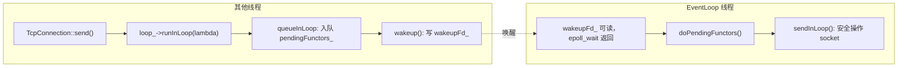
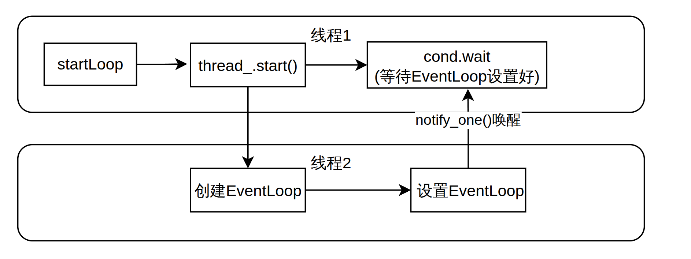
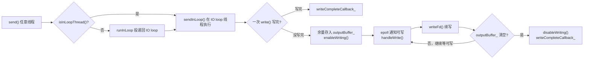
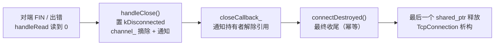

# 各个部分设计的职责

## 基础组件

- **buffer**：面向网络 IO 的可增长字节缓冲区，用读写下标把内部 `vector` 划分为可读/可写两段，屏蔽扩容细节。
- **currentthread**：用 `thread_local` 缓存当前线程的 OS 级 `pid_t tid`，供 EventLoop 做线程归属断言。
- **logger**：单例同步日志，暴露 `LOGINFO / LOGERROR` 等模板函数，用 C++20 `std::format` 格式化后输出到标准输出。
- **noncopyable**：删除拷贝构造和拷贝赋值的基类，需要禁止拷贝的类 `private` 继承它即可。
- **thread**：对 `std::thread` 的封装，补充了标准库缺失的 OS 级 `tid`、线程命名和全局创建计数。
- **timestamp**：微秒精度的时间戳值类型，提供 `now()` 和算术辅助 `addTime`，是计时和定时的基础类型。

## 网络组件

- **callbacks**：集中定义所有回调类型别名（`ConnectionCallback / MessageCallback` 等）和 `TcpConnectionPtr`，避免各模块之间的循环包含。
- **inetaddress**：IPv4 地址和端口的封装，负责字符串与 `sockaddr_in` 之间的互转。
- **socket**：RAII 封装 socket fd，聚合 `bind / listen / accept / shutdownWrite` 及常用 socket 选项设置。
- **channel**：将一个 fd 与其关心的事件和四个回调绑定，事件变化时通知 Poller，事件到来时分发回调。
- **poller / epollpoller**：IO 多路复用的抽象层和 epoll 实现，将就绪 fd 转换成活跃 Channel 列表交给 EventLoop。
- **eventloop**：单线程 Reactor 核心，驱动"等待事件 → 分发回调 → 执行跨线程任务"的主循环，用 eventfd 实现跨线程唤醒。
- **acceptor**：持有监听 socket 和 Channel，有新连接时 accept 后通过回调将已连接 fd 交给上层，自身不管理连接生命周期。
- **tcpconnection**：表示一条 TCP 连接，持有 socket 和 Channel，维护输入输出双缓冲，实现非阻塞发送和半关闭。
- **eventloopthread**：在独立后台线程中运行一个 **EventLoop**，`startLoop()` 阻塞等待 loop 就绪后返回其指针。
- **eventloopthreadpool**：管理一组 **EventLoopThread**，提供轮询分配 `getNextLoop()`，线程数为 0 时退化为单线程。
- **tcpserver**：用户入口，协调 Acceptor 和线程池，将新连接分配给 IO 线程，并管理全部连接的生命周期。


# 基础运行逻辑

## 1.Channel如何被EpollPoller监听?

并没有EventLoop.setChannel这样的操作,那么EventLoop是如何知道自己要监管哪些Channel呢?

逻辑是这样的,在Channel的构造函数中

```cpp
Channel::Channel(EventLoop* loop, int fd)
    : loop_(loop), fd_(fd), events_(0), revents_(0), pollerState_(-1), tied_(false) {}
```

Channel由此获得了指向所属EventLoop的指针.

当持有这个Channel的Acceptor或者TcpConnection希望监听某种事件时,会调用

```cpp
  /**
   * @brief 开启读事件监听。
   */
  inline void enableReading() {
    events_ |= kReadEvent;
    update();
  }
```

设置好Channel的事件标记后会调用update()函数

```cpp
void Channel::update() {
  loop_->updateChannel(this);
}

void EventLoop::updateChannel(Channel* channel) {
  poller_->updateChannel(channel);
}

//kNew：Channel 从未注册过 → 加入 channels_ map，EPOLL_CTL_ADD
//kAdded：Channel 已在 epoll 中 → EPOLL_CTL_MOD（或无事件时 EPOLL_CTL_DEL 临时摘除）
//kDeleted：曾被临时摘除，但还在 channels_ map 里 → 直接 EPOLL_CTL_ADD 重新加回
void EpollPoller::updateChannel(Channel* channel) {
  const int pollerState = channel->pollerState();
  const int fd = channel->fd();

  if (pollerState == kNew || pollerState == kDeleted) {
    if (pollerState == kNew) {
      channels_[fd] = channel;
    }
    channel->setPollerState(kAdded);
    update(EPOLL_CTL_ADD, channel);
  } else {
    if (channel->isNoneEvent()) {
      // 零时将channel从epoll中删除，但不从channels_中删除
      // 后续如果又有事件发生时再添加回epoll
      update(EPOLL_CTL_DEL, channel);
      channel->setPollerState(kDeleted);
    } else {
      update(EPOLL_CTL_MOD, channel);
    }
  }
}


void EpollPoller::update(int operation, Channel* channel) {
  epoll_event event{};
  event.events = channel->events();
  event.data.ptr = channel;

  const int fd = channel->fd();
  if (::epoll_ctl(epollfd_, operation, fd, &event) < 0) {
    LOGERROR("EpollPoller::update() epoll_ctl operation {:d} fd {:d} error: {:d}", operation, fd,
             errno);
    if (operation != EPOLL_CTL_DEL) {
      abort();
    }
  }
}
```

这一系列操作旨在通过 EventLoop 这个中间人，使 Channel 能够让 EpollPoller 调用 **update** 函数将对应的 fd 加入 epoll 监控，并<span style="color:dodgerblue">将 Channel 自身的指针存入 `event.data.ptr` 中</span>——这样事件就绪时就能直接从 epoll 返回的结果里取回对应的 Channel。


## 2.EventLoop在事件循环的时候如何触发Channel的回调？

循环的核心部分

```cpp
void EventLoop::loop() {
  looping_ = true;
  quit_ = false;

  while (!quit_) {
    activeChannels_.clear();
    pollReturnTime_ = poller_->poll(kPollTimeMs, &activeChannels_);
    for (Channel* channel : activeChannels_) {
      channel->handleEvent(pollReturnTime_);
    }
    doPendingFunctors();
  }

  LOGINFO("EventLoop stop looping");
  looping_ = false;
}
```

关注核心的循环步骤

1. 清空之前的 activeChannels（也就是上一次循环中<u>触发了监控事件</u>的 Channels）
2. 使用 Poller 获得一段时间内<u>触发监控事件</u>的 Channels（即 activeChannels）
3. 遍历触发事件对应的 Channel
   - 至于执行哪些操作，取决于 Channel 此时的状态和回调函数
4. 调用 doPendingFunctors 操作，处理需要 EventLoop 执行的跨线程操作

<span style="color:dodgerblue">EventLoop 依赖 Poller 做事件监控、依赖 Channel 自身做事件处理，但整体的执行顺序由 EventLoop 掌控。</span>


## 3.何时需要跨线程操作？

每个 EventLoop 只属于一个线程，它管理的 `Channel`、`Buffer`、socket 操作都没有加锁，<u>只能在 EventLoop 所属线程中访问</u>。但上层业务逻辑（如调用 `TcpConnection::send()`）可能运行在其他线程，<span style="color:dodgerblue">这就产生了跨线程操作的需求</span>。

解决方式是通过 `runInLoop` / `queueInLoop` 将任务投递给 EventLoop 所属线程执行：

```cpp
void TcpConnection::send(const std::string& message) {
  if (loop_->isInLoopThread()) {
    sendInLoop(message);         // 已在 EventLoop 线程，直接执行
  } else {
    loop_->runInLoop([self = shared_from_this(), message]() {
      self->sendInLoop(message); // 投递任务，由 EventLoop 线程执行
    });
  }
}
```

`sendInLoop` 直接操作 socket 和 `outputBuffer_`，<u>必须在 EventLoop 线程中执行</u>。lambda 捕获 `shared_from_this()` 而非 `this`，是因为任务入队后不会立刻执行，<span style="color:crimson">若 `TcpConnection` 在此期间析构，捕获的 `this` 会成为悬空指针</span>。

#### queueInLoop 与唤醒机制

```cpp
void EventLoop::queueInLoop(const Functor& cb) {
  {
    std::lock_guard<std::mutex> lock(mutex_);
    pendingFunctors_.push_back(cb);
  }
  if (!isInLoopThread() || callingPendingFunctors_) {
    wakeup();
  }
}
```

任务入队后，EventLoop 可能正阻塞在 `epoll_wait` 中，需要主动唤醒它。`wakeup()` 通过向 `wakeupFd_`（一个 eventfd）写入 8 字节整数，使其变为可读，从而让 `epoll_wait` 立刻返回。

`callingPendingFunctors_` 为 true 时也需要唤醒：此时 EventLoop 正在执行当前这批 functors，新投递的任务不会在本轮被处理，需要唤醒以触发下一轮循环。

#### doPendingFunctors 的执行

每轮 EventLoop 循环末尾，`doPendingFunctors()` 会取出队列中所有任务执行：

```cpp
void EventLoop::doPendingFunctors() {
  std::vector<Functor> functors;
  callingPendingFunctors_ = true;
  {
    std::lock_guard<std::mutex> lock(mutex_);
    functors.swap(pendingFunctors_);  // 整体换出，立刻释放锁
  }
  for (const Functor& functor : functors) {
    functor();
  }
  callingPendingFunctors_ = false;
}
```

用 `swap` 而非直接遍历 `pendingFunctors_` 的原因：回调执行可能很耗时，<u>如果持锁期间执行回调，其他线程调用 `queueInLoop` 时会一直阻塞等锁</u>。<span style="color:dodgerblue">整体换出后锁立刻释放，回调在锁外执行，其他线程可以继续投递新任务。</span>

整体调用链：




## 4.Acceptor从初始化到创建一个新连接的过程

#### 第一步：构造 Acceptor

```cpp
Acceptor::Acceptor(EventLoop* loop, const InetAddress& listenAddr, bool reuseport)
    : loop_(loop),
      acceptSocket_(::socket(AF_INET, SOCK_STREAM | SOCK_NONBLOCK | SOCK_CLOEXEC, 0)),
      acceptChannel_(loop, acceptSocket_.fd()),
      listenning_(false) {
  acceptSocket_.setReuseAddr(true);
  acceptSocket_.setReusePort(reuseport);
  acceptSocket_.bindAddress(listenAddr);
  acceptChannel_.setReadCallback(std::bind(&Acceptor::handleRead, this));
}
```

构造时做了三件事：
1. 创建监听 socket（`SOCK_NONBLOCK` 非阻塞，`SOCK_CLOEXEC` exec 时自动关闭）
2. 用监听 socket 的 `fd` 创建 `acceptChannel_`，绑定到所属 EventLoop
3. 将 `handleRead` 注册为 `acceptChannel_` 的读事件回调，但<u>此时还未开启监听</u>

#### 第二步：调用 listen()

```cpp
void Acceptor::listen() {
  listenning_ = true;
  acceptSocket_.listen();
  acceptChannel_.enableReading();
}
```

`acceptChannel_.enableReading()` 会触发第 1 节中描述的注册链，将监听 socket 加入 epoll。<span style="color:dodgerblue">从这一刻起 Acceptor 准备完成，EventLoop 开始等待新连接到来。</span>

#### 第三步：新连接到达，触发 handleRead

epoll 检测到监听 socket 可读（即有新连接请求），EventLoop 调用 `acceptChannel_.handleEvent()`，进而触发注册的读回调：

```cpp
void Acceptor::handleRead() {
  InetAddress peerAddr;
  int connfd = acceptSocket_.accept(&peerAddr);
  if (connfd >= 0) {
    if (newConnectionCallback_) {
      newConnectionCallback_(connfd, peerAddr);  // 把已连接 fd 交给上层
    } else {
      ::close(connfd);
    }
  }
}
```

`accept()` 返回的 `connfd` 是与客户端建立好的已连接 socket，<u>与监听 socket 完全独立</u>。<span style="color:dodgerblue">Acceptor 自身不管理这个 fd，直接通过 `newConnectionCallback_` 交给上层处理。</span>

#### 第四步：上层创建 TcpConnection

在 `main.cpp` 中，`newConnectionCallback_` 被设置为：

```cpp
acceptor.setNewConnectionCallback([&](int connfd, const InetAddress& peerAddr) {
  auto conn = std::make_shared<TcpConnection>(&loop, connName, connfd, localAddr, peerAddr);
  // 注册业务回调...
  connections[connName] = conn;
  conn->connectEstablished();
});
```

`TcpConnection` 构造时为 `connfd` 创建一个新的 `Channel`，并挂载读写、关闭、错误四个回调。调用 `connectEstablished()` 后，连接正式激活：

```cpp
void TcpConnection::connectEstablished() {
  state_ = StateE::kConnected;
  channel_->tie(shared_from_this());  // 防止事件处理期间 TcpConnection 被析构
  channel_->enableReading();          // 将已连接 socket 注册到 epoll
  if (connectionCallback_) connectionCallback_(shared_from_this());
}
```

`channel_->tie()` 的作用：Channel 内部用 `weak_ptr` 保存 TcpConnection 的引用，每次 `handleEvent` 时尝试提升为 `shared_ptr`。<u>若提升失败，说明 TcpConnection 已析构</u>，则跳过回调，<span style="color:crimson">避免访问已释放内存（use-after-free）</span>。

#### 整体调用链

```mermaid
flowchart LR
    subgraph init["初始化阶段"]
        A["main() 构造 Acceptor<br/>注册 newConnectionCallback_"] --> B["acceptor.listen()"]
        B --> C["acceptChannel_.enableReading()<br/>监听 socket 加入 epoll"]
    end
    subgraph conn["新连接到达"]
        D["EventLoop::loop()<br/>epoll_wait 返回，acceptChannel_ 活跃"] --> E["acceptChannel_.handleEvent()"]
        E --> F["Acceptor::handleRead()"]
        F --> G["accept() 得到 connfd"]
        G --> H["newConnectionCallback_(connfd, peerAddr)"]
        H --> I["创建 TcpConnection"]
        I --> J["connectEstablished()"]
        J --> K["channel_->enableReading()<br/>已连接 socket 加入 epoll"]
    end
    C -.有新连接请求.-> D
```



至此，新连接的 Channel 已注册到 EventLoop，<span style="color:dodgerblue">后续客户端发来的数据会直接触发 `TcpConnection::handleRead()`</span>。


****

## 5.为什么需要EventLoopThread相关部分呢？

### EventLoopThread的意义

首先看看EventLoopThread的设计，构造函数比较简单

```cpp
using ThreadInitCallback = std::function<void(EventLoop*)>;

EventLoopThread::EventLoopThread(const ThreadInitCallback& cb, const std::string& name)
    : loop_(nullptr), exiting_(false),
      thread_(std::bind(&EventLoopThread::threadFunc, this), name),
      callback_(cb) {}
```

 就是给这个线程设置好任务函数、回调函数和线程的名字，没什么特别的

那么关键就是在于`threadFunc`和`startloop`这两个**核心功能函数**

先看threadFunc的定义

```cpp
void EventLoopThread::threadFunc() {
  EventLoop loop;
  if (callback_) callback_(&loop);
  {
    std::lock_guard<std::mutex> lock(mutex_);
    loop_ = &loop;
    condVar_.notify_one();
  }
  loop.loop();
}
```

在EventLoop线程类构造的时候就配置好了线程函数，流程如下：

1. 初始化一个EventLoop对象
2. 如果设置回调，那么就执行回调
3. 进入临界区，需要锁进行保护
   - 将loop的地址设置好（作用何在）
   - 唤醒一个等待loop对象的地方
4. 事件循环开始

是不是感觉设计很迷惑，明明我们的核心目的就是让事件循环开始，别的地方能够拿到指针就可以了，为什么需要notify_one呢？

先别急，接着往下看startloop的设计

```cpp
EventLoop* EventLoopThread::startLoop() {
  thread_.start();
  EventLoop* loop = nullptr;
  {
    std::unique_lock<std::mutex> lock(mutex_);
    while (loop_ == nullptr) condVar_.wait(lock);
    loop = loop_;
  }
  return loop;
}

```

这是一个供外部调用的方法，具体逻辑如下

1. 启动任务线程，然后返回
   - 也就是`threadFunc`
2. 然后轮询检查loop_是否被设置
   - 没有被设置，休眠
   - 被设置了，那么就存储loop的地址
3. 返回创建的loop的地址

这个函数的作用就是启动一个执行EventLoop事件循环的线程，然后将EventLoop对象的地址返回给外界，方便外部向事件循环中注册新的channel和添加任务。

所以这里就可以懂得`notify_one`和`wait`的意义了，如同下图所示：



如果没有 notify 和 wait 的配合，<span style="color:crimson">就只能在原地忙等（busy-wait）轮询 `loop_`，白白浪费 CPU</span>。

> 那么为什么 `while (loop_ == nullptr) condVar_.wait(lock);` 用 while 而不用 if 呢？
>
> 原因在于<u>防止**假唤醒**</u>：条件变量在某些操作系统实现下，即使没人调用 `notify`，`wait` 也可能自己醒来。用 while 在每次醒来后重新校验条件，假唤醒就继续等，不会误以为 `loop_` 已就绪。

<span style="color:dodgerblue">总结来看，EventLoopThread 的核心意义在于把 EventLoop 包装成一个 RAII 结构，方便地创建、启动和析构一个 EventLoop 循环，降低管理多线程 EventLoop 的复杂度。</span>


### EventLoopThreadPool的作用

根据这个类的命名就能够分析出这个是用来管理多个事件循环线程的线程池，但显然绝对不可能仅仅负责多个EventLoop线程的创建和销毁。

来看看这个类的设计，首先是构造函数

```cpp
EventLoopThreadPool::EventLoopThreadPool(EventLoop* baseLoop, const std::string& name)
    : baseLoop_(baseLoop), name_(name), started_(false), numThreads_(0), next_(0) {}
```

你会意识到，明明管理多个EventLoop线程的线程池，构造的时候反而需要一个BaseLoop,这是为什么呢？这里先按下不表，接着往后看

看start函数定义

```cpp
void EventLoopThreadPool::start(const ThreadInitCallback& cb) {
  started_ = true;
  for (int i = 0; i < numThreads_; ++i) {
    std::string threadName = name_ + std::to_string(i);
    auto* t = new EventLoopThread(cb, threadName);
    threads_.emplace_back(t);
    loops_.push_back(t->startLoop());
  }
}
```

创建**numThreads**个**EventLoop**，将**EventLoopThreads**通过emplace_back构造并存储在threads，以便在结束时自动析构，同时调用**t->startloop（）**启动事件循环，同时将指针存储到loops_中，便于后续使用

这个很好理解，构建并存储几个线程而已。

那么**baseLoop_**的作用究竟在哪儿呢？答案在两个函数

```cpp
EventLoop* EventLoopThreadPool::getNextLoop() {
  EventLoop* loop = baseLoop_;
  if (!loops_.empty()) {
    loop = loops_[next_];
    if (++next_ >= static_cast<int>(loops_.size())) next_ = 0;
  }
  return loop;
}

std::vector<EventLoop*> EventLoopThreadPool::getAllLoops() {
  if (loops_.empty()) return {baseLoop_};
  return loops_;
}
```

这两个函数都要区分 `loops_` 是否为空两种情况：

- **`loops_` 非空（多线程模式）**：`getNextLoop()` 以轮询（round-robin）方式**不断从线程池中取出下一个可用的 EventLoop**，把连接均摊到各个 IO 线程上，不过这里只是简单轮询，没有做基于负载的均衡。
- **`loops_` 为空（单线程模式）**：直接返回 `baseLoop_`，给出一个可用的**单线程事件循环**（其实就是退化成了单线程），而这个 loop 正是构造时传入的 **baseLoop_**。

这就是 `baseLoop_` 存在的意义：<span style="color:dodgerblue">当线程数为 0 时，它作为兜底的 EventLoop，让上层代码无需区分单 / 多线程即可统一使用 `getNextLoop()`。</span>

>  需要注意的是，轮询只负责分配，并不保证拿到的连接在事件处理期间一直存活。当 EventLoop 正在分发某个 Channel 的回调时，可能有其他路径把对应的 TcpConnection 析构掉，导致 use-after-free。为此 Channel 在 handleEvent 中用 tie_ 做了一道保护：
>
> ```cpp
> void Channel::handleEvent(Timestamp receiveTime) {
>   if (tied_) {
>     std::shared_ptr<void> guard = tie_.lock();	// 提升 weak_ptr，确认 TcpConnection 仍存活
>     if (guard)
>       handleEventWithGuard(receiveTime);        // 提升成功，回调期间 guard 保证对象不被析构
>   } else {
>     handleEventWithGuard(receiveTime);
>   }
> }
> ```
>
> `tie_` 是一个 `weak_ptr<void>`，在 `connectEstablished()` 里通过 `channel_->tie(shared_from_this())` 绑定到所属的 TcpConnection。`lock()` 检查的是 **TcpConnection 本身是否还活着**（而非 EventLoop 或线程），提升出的 `guard` 在整个回调执行期间持有一份额外的 `shared_ptr`，确保对象不会在回调中途被销毁。


综上所述，EventLoopThreadPool 的核心意义在于三点：

1. **多线程 IO**：创建若干个独立的 IO 线程（每个线程持有一个 EventLoop），让多条连接可以并行处理读写，避免单线程成为瓶颈。
2. **轮询分配**：通过 `getNextLoop()` 以 round-robin 方式将连接分配给不同的 IO 线程，实现简单的负载分散。
3. **单线程退化**：当 `numThreads_ == 0` 时，`getNextLoop()` 直接返回 `baseLoop_`，整个服务器退化为单 Reactor 单线程模式，上层代码无需任何改动。


## 6. TcpConnection 的设计

### 先理清：TcpConnection 绑定在哪个线程上？

TcpConnection 自己**不创建、也不拥有** EventLoop。它在构造时由外部传入一个 `EventLoop*`，存为成员 `loop_`：

```cpp
TcpConnection::TcpConnection(EventLoop* loop, std::string name, int sockfd, ...)
    : loop_(loop), ... {}
```

这个 `loop_` 就是这条连接的"归属线程"。整个类有一条贯穿始终的约定：

> TcpConnection 的所有成员——`channel_`、`inputBuffer_`、`outputBuffer_`、socket 读写，以及 handleRead / handleWrite / handleClose / handleError 这四个回调——<u>都只在 `loop_` 所属的那个线程上执行</u>。

正因如此，这些成员<span style="color:dodgerblue">不需要任何锁</span>：同一时刻只会有 `loop_` 这一个线程去碰它们。这也是后面频繁出现 **sendInLoop**、**shutdownInLoop** 这种 `xxxInLoop` 命名的原因——带 `InLoop` 后缀的函数都隐含<u>必须在 `loop_` 线程里执行</u>这一前提。

至于这个 `loop_` 由谁传进来、程序里到底有几个 EventLoop、一条连接是怎么被分到某个 loop 上的，这些都是更上层（线程池、以及之后会讲的服务器入口）的职责，TcpConnection 本身并不关心。这里只需记住一句话：<span style="color:dodgerblue">一条 TcpConnection 从生到死都钉在 `loop_` 这一个线程上</span>。

### TcpConnection 的生命周期与状态机

TcpConnection 有四个状态，贯穿整个连接的生命周期：

```
kConnecting → kConnected → kDisconnecting → kDisconnected
```

- **kConnecting**：TcpConnection 刚被构造，socket 已 accept 但 `connectEstablished()` 尚未调用。
- **kConnected**：`connectEstablished()` 执行完毕，Channel 已注册到 epoll，连接正式激活。
- **kDisconnecting**：调用了 `shutdown()`，等待 `outputBuffer_` 发送完毕后再真正关闭写端。
- **kDisconnected**：`handleClose()` 或 `connectDestroyed()` 执行后，Channel 从 epoll 摘除。

状态只在 <u>IO 线程（`loop_` 所属线程）上流转，因此无需加锁</u>。


### 为什么 TcpConnection 要继承 enable_shared_from_this？

TcpConnection 在三个地方会被持有：TcpServer 的 `connections_` 表、Channel 注册的各个回调 lambda、用户的业务回调。这三者的生命周期各不相同，因此 TcpConnection 必须以 `shared_ptr` 的形式共享所有权。

`enable_shared_from_this` 的作用是让对象在成员函数内部安全地获取指向自身的 `shared_ptr`，而不是用 `this` 裸指针：

```cpp
// 投递给 IO 线程时，捕获 shared_ptr 而非 this，防止任务执行前对象被析构
loop_->runInLoop([self = shared_from_this(), message]() {
    self->sendInLoop(message);
});
```

如果捕获 `this`，<span style="color:crimson">任务在队列里等待期间 `TcpConnection` 可能已被销毁，执行时就会访问悬空指针</span>。


### 关于TcpConnection的数据发送

连接建立和销毁的 `connectEstablished` / `connectDestroyed` 由外部控制；而 handleRead、handleWrite、handleClose、handleError 只是注册给 Channel 的四个回调，处理一条 TCP 连接的基础读写事件：

```cpp
channel_->setReadCallback([this](Timestamp t) { handleRead(t); });
channel_->setWriteCallback([this]() { handleWrite(); });
channel_->setCloseCallback([this]() { handleClose(); });
channel_->setErrorCallback([this]() { handleError(); });
```

<span style="color:dodgerblue">真正值得细看的是数据的发送</span>——接收是被动的（epoll 报告可读后由 `handleRead` 读入），而发送要自己处理<u>"一次写不完"</u>的情况。

首先看 `send` 的定义：

```cpp
void TcpConnection::send(const std::string& message) {
  if (state_ == StateE::kConnected) {
    if (loop_->isInLoopThread())
      sendInLoop(message);
    else
      loop_->runInLoop([self = shared_from_this(), message]() { self->sendInLoop(message); });
  }
}
```

逻辑如下：

1. 判断当前的Tcp状态，如果已经建立连接`StateE::kConnected`才会执行后续操作
2. 判断当前的工作线程
   1. 如果当前在EventLoop的线程中，那么则调用**sendInLoop(message)**立刻发送数据
   2. 如果不在EventLoop线程，那么则调用**runInLoop**将当前的数据发送操作任务放入EventLoop的任务队列中

为什么会需要这个判断呢？这里先按下不表，先看看sendInLoop的定义

```cpp
void TcpConnection::sendInLoop(const std::string& message) {
  ssize_t nwrote = 0;
  size_t remaining = message.size();
  bool faultError = false;

  // 连接已断开，放弃发送
  if (state_ == StateE::kDisconnected) {
    LOGERROR("TcpConnection::sendInLoop() disconnected, give up writing");
    return;
  }

  // 如果没有正在写且输出缓冲区没有待发送数据，尝试直接写入 socket
  if (!channel_->isWriting() && outputBuffer_.readableBytes() == 0) {
    // 直接写入数据到 socket，减少一次内核拷贝
    nwrote = ::write(channel_->fd(), message.data(), message.size());
    if (nwrote >= 0) {
      remaining = message.size() - static_cast<size_t>(nwrote);
      if (remaining == 0 && writeCompleteCallback_)
        loop_->queueInLoop([self = shared_from_this()] { self->writeCompleteCallback_(self); });
    } else {
      nwrote = 0;
      if (errno != EWOULDBLOCK) {
        LOGERROR("TcpConnection::sendInLoop() write error: {}", errno);
        if (errno == EPIPE || errno == ECONNRESET)
          faultError = true;
      }
    }
  }

  // 检查是否有剩余数据需要发送，或之前写入时发生了错误
  if (!faultError && remaining > 0) {
    const size_t oldLen = outputBuffer_.readableBytes();
    if (oldLen + remaining >= highWaterMark_ && oldLen < highWaterMark_ && highWaterMarkCallback_) {
      loop_->queueInLoop([self = shared_from_this(), len = oldLen + remaining] {
        self->highWaterMarkCallback_(self, len);
      });
    }
    outputBuffer_.append(message.data() + nwrote, remaining);
    if (!channel_->isWriting())
      channel_->enableWriting();
  }
}
```

逻辑如下：

1. 检查连接状态
2. 判断channel和outputbuffer状态，是否可以进行写操作
3. 向channel对应socket的fd写入message数据
   1. 如果写入成功且全部写完，那么就将**写完回调放入Loop的任务队列中**
   2. 如果写入不成功，错误处理
4. 如果有剩余数据没发送完
   1. 检查outputbuffer中目前的数据量
   2. 如果要发送的总数据量超过高水位，但是已有数据量尚未超过高水位，那么就向EventLoop的任务队列中添加高水位处理任务
   3. 然后将message中尚未发送的数据添加进outputbuffer
   4. 将channel的状态设置为可写入，等待EventLoop的Epoller监控到channel可写时调用handleWrite完成剩下的写入


#### 回到前面的疑问：为什么 send 要判断线程？

现在可以回答 `send()` 里那个 `isInLoopThread()` 判断的意义了。

关键前提是 **one loop per thread**：每个 TcpConnection 都归属于某个固定的 IO loop（`loop_`），它的 `channel_`、`outputBuffer_`、socket 这些成员**没有任何加锁保护**，约定上只能由 `loop_` 所属的那个线程访问。

而 `send()` 是暴露给用户的公开接口，**任何线程都可能调用它**。常见的两种情形：

- 在 `messageCallback_` 里直接 `conn->send(resp)`——此时本来就在 IO loop 线程，`isInLoopThread()` 为 true，直接调 `sendInLoop` 即可。
- 在用户自己的工作线程里算完结果后 `conn->send(result)`——此时不在 IO loop 线程，`isInLoopThread()` 为 false。

如果第二种情形也直接调 `sendInLoop`，<span style="color:crimson">就会有两个线程同时操作同一个 `outputBuffer_`，造成数据竞争</span>。所以这里通过 `runInLoop` 把发送任务投递回 `loop_` 所属线程，<u>保证 `sendInLoop` 永远只在那一个线程里执行</u>——这样无需加锁也能线程安全。这正是第 3 节"何时需要跨线程操作"在 TcpConnection 上的具体应用。


#### 没写完的数据：handleWrite 续写

`sendInLoop` 里如果数据没一次写完，会把剩余部分留在 `outputBuffer_` 并 `enableWriting()`。之后 socket 缓冲区腾出空间变为可写时，epoll 通知 EventLoop，触发 `handleWrite()` 继续把剩余数据写出去：

```cpp
void TcpConnection::handleWrite() {
  int savedErrno = 0;
  const ssize_t n = outputBuffer_.writeFd(channel_->fd(), &savedErrno);
  if (n > 0) {
    if (outputBuffer_.readableBytes() == 0) {   // 缓冲区清空，发送完毕
      channel_->disableWriting();               // 关闭写监听，避免 epoll 空转
      if (writeCompleteCallback_)
        writeCompleteCallback_(shared_from_this());
      if (state_ == StateE::kDisconnecting)      // 之前调过 shutdown，等发完再真正关
        shutdownInLoop();
    }
  } else {
    errno = savedErrno;
    LOGERROR("TcpConnection::handleWrite() error");
    handleError();
  }
}
```

注意 `disableWriting()` 这一步很关键：写事件是 **电平触发（LT）**，只要 socket 可写就会一直通知。<span style="color:crimson">如果数据已经发完还不关闭写监听，epoll 会反复唤醒造成 CPU 空转</span>。所以 <u>"发不完才开写监听、发完立即关"</u> 是这里的核心节奏。

至此发送流程才算闭环：



#### 连接关闭流程

被动关闭由对端发来 FIN 触发：epoll 把它识别为可读事件，`handleRead()` 读到 0 字节后转入 `handleClose()`：

```cpp
void TcpConnection::handleClose() {
  state_ = StateE::kDisconnected;
  channel_->disableAll();        // 从 epoll 摘除所有事件
  channel_->remove();            // 从 Poller 的 channels_ 表中删除
  if (connectionCallback_)
    connectionCallback_(shared_from_this());  // 通知用户连接断开
  if (closeCallback_)
    closeCallback_(shared_from_this());       // 通知 TcpServer 移除连接记录
}
```

`handleClose()` 做的都是 TcpConnection 自己这一侧的收尾：把状态置为 `kDisconnected`、把 `channel_` 从所属 loop 的 epoll 里摘掉，再通过两个回调向外通报。

这里的关键在于 TcpConnection **不负责销毁自己**。前面说过，它的生命周期由外部持有者（构造时传入 `loop_`、并持有它 `shared_ptr` 的那个上层，之后会讲到的服务器入口）掌管。所以它能做的只是触发 `closeCallback_`，告诉持有者"我这条连接要关了，请把你手里指向我的那份引用去掉"。`closeCallback_` 的具体内容由持有者在创建连接时注册，这里不展开。

为什么不在 `handleClose()` 里直接把自己删掉？因为此刻正运行在 `channel_->handleEvent()` 内部——也就是说，正踩在自己的 Channel 上执行回调。<span style="color:crimson">如果这时把 TcpConnection（连同它的 `channel_`）销毁，函数返回后 `handleEvent` 还要继续访问已释放的 `channel_`，就是 use-after-free</span>。所以 <u>销毁动作必须延后</u>：先通知持有者解除引用，等真正没人用了再析构。

最后真正的清理落在 `connectDestroyed()`：

```cpp
void TcpConnection::connectDestroyed() {
  if (state_ != StateE::kDisconnected) {   // 幂等保护，重复调用不出错
    state_ = StateE::kDisconnected;
    channel_->disableAll();
    channel_->remove();
    if (connectionCallback_)
      connectionCallback_(shared_from_this());
  }
}
```

它和 `handleClose` 都会 `disableAll/remove`，看似重复，其实是为了覆盖两条不同的关闭路径：

- **被动关闭**：对端断开 → `handleClose()` 已经摘除过 channel，`connectDestroyed` 走到时 `state_` 已是 `kDisconnected`，靠开头的 `if` 跳过，不重复操作。
- **主动关闭**：持有者主动结束连接时直接调 `connectDestroyed()`，没经过 `handleClose`，这时就由它来完成摘除。

<span style="color:dodgerblue">幂等保护（`state_ != kDisconnected`）保证了无论哪条路径、调用几次都安全。</span>



> 注意整条链路里"持有者怎么解除引用、为什么中间还要在不同线程之间倒手"涉及上层服务器的设计，等讲到那部分再补。这里只需记住 TcpConnection 自己的责任边界：<span style="color:dodgerblue">摘掉自己的 channel、发出关闭通知，但把真正的销毁交给持有者，并用"延后 + 幂等"避免在事件处理途中自毁。</span>


## 组件的集合体TcpServer

