# 各个部分设计的职责

## 基础组件

- **buffer**：面向网络 IO 的可增长字节缓冲区，用读写下标把内部 `vector` 划分为可读/可写两段，屏蔽扩容细节。
- **currentthread**：用 `thread_local` 缓存当前线程的 OS 级 `pid_t tid`，供 EventLoop 做线程归属断言。
- **logger**：单例同步日志，暴露 `LOGINFO / LOGERROR` 等模板函数，用 C++20 `std::format` 格式化后输出到标准输出。
- **noncopyable**：删除拷贝构造和拷贝赋值的基类，需要禁止拷贝的类 `private` 继承它即可。
- **thread**：对 `std::thread` 的封装，补充了标准库缺失的 OS 级 `tid`、线程命名和全局创建计数。
- **timestamp**：微秒精度的时间戳值类型，提供 `now()` 和算术辅助 `addTime`，是计时和定时的基础类型。

## 网络组件

- **callbacks**：集中定义所有回调类型别名（`ConnectionCallback / MessageCallback` 等）和 `TcpConnectionPtr`，避免各模块之间的循环包含。
- **inetaddress**：IPv4 地址和端口的封装，负责字符串与 `sockaddr_in` 之间的互转。
- **socket**：RAII 封装 socket fd，聚合 `bind / listen / accept / shutdownWrite` 及常用 socket 选项设置。
- **channel**：将一个 fd 与其关心的事件和四个回调绑定，事件变化时通知 Poller，事件到来时分发回调。
- **poller / epollpoller**：IO 多路复用的抽象层和 epoll 实现，将就绪 fd 转换成活跃 Channel 列表交给 EventLoop。
- **eventloop**：单线程 Reactor 核心，驱动"等待事件 → 分发回调 → 执行跨线程任务"的主循环，用 eventfd 实现跨线程唤醒。
- **acceptor**：持有监听 socket 和 Channel，有新连接时 accept 后通过回调将已连接 fd 交给上层，自身不管理连接生命周期。
- **tcpconnection**：表示一条 TCP 连接，持有 socket 和 Channel，维护输入输出双缓冲，实现非阻塞发送和半关闭。
- **eventloopthread**：在独立后台线程中运行一个 **EventLoop**，`startLoop()` 阻塞等待 loop 就绪后返回其指针。
- **eventloopthreadpool**：管理一组 **EventLoopThread**，提供轮询分配 `getNextLoop()`，线程数为 0 时退化为单线程。
- **tcpserver**：用户入口，协调 Acceptor 和线程池，将新连接分配给 IO 线程，并管理全部连接的生命周期。


# 基础运行逻辑

## 1.Channel如何被EpollPoller监听?

并没有EventLoop.setChannel这样的操作,那么EventLoop是如何知道自己要监管哪些Channel呢?

逻辑是这样的,在Channel的构造函数中

```cpp
Channel::Channel(EventLoop* loop, int fd)
    : loop_(loop), fd_(fd), events_(0), revents_(0), pollerState_(-1), tied_(false) {}
```

Channel由此获得了指向所属EventLoop的指针.

当持有这个Channel的Acceptor或者TcpConnection希望监听某种事件时,会调用

```cpp
  /**
   * @brief 开启读事件监听。
   */
  inline void enableReading() {
    events_ |= kReadEvent;
    update();
  }
```

设置好Channel的事件标记后会调用update()函数

```cpp
void Channel::update() {
  loop_->updateChannel(this);
}

void EventLoop::updateChannel(Channel* channel) {
  poller_->updateChannel(channel);
}

//kNew：Channel 从未注册过 → 加入 channels_ map，EPOLL_CTL_ADD
//kAdded：Channel 已在 epoll 中 → EPOLL_CTL_MOD（或无事件时 EPOLL_CTL_DEL 临时摘除）
//kDeleted：曾被临时摘除，但还在 channels_ map 里 → 直接 EPOLL_CTL_ADD 重新加回
void EpollPoller::updateChannel(Channel* channel) {
  const int pollerState = channel->pollerState();
  const int fd = channel->fd();

  if (pollerState == kNew || pollerState == kDeleted) {
    if (pollerState == kNew) {
      channels_[fd] = channel;
    }
    channel->setPollerState(kAdded);
    update(EPOLL_CTL_ADD, channel);
  } else {
    if (channel->isNoneEvent()) {
      // 零时将channel从epoll中删除，但不从channels_中删除
      // 后续如果又有事件发生时再添加回epoll
      update(EPOLL_CTL_DEL, channel);
      channel->setPollerState(kDeleted);
    } else {
      update(EPOLL_CTL_MOD, channel);
    }
  }
}


void EpollPoller::update(int operation, Channel* channel) {
  epoll_event event{};
  event.events = channel->events();
  event.data.ptr = channel;

  const int fd = channel->fd();
  if (::epoll_ctl(epollfd_, operation, fd, &event) < 0) {
    LOGERROR("EpollPoller::update() epoll_ctl operation {:d} fd {:d} error: {:d}", operation, fd,
             errno);
    if (operation != EPOLL_CTL_DEL) {
      abort();
    }
  }
}
```

这一系列操作旨在通过 EventLoop 这个中间人，使 Channel 能够让 EpollPoller 调用 **update** 函数将对应的 fd 加入 epoll 监控，并<span style="color:dodgerblue">将 Channel 自身的指针存入 `event.data.ptr` 中</span>——这样事件就绪时就能直接从 epoll 返回的结果里取回对应的 Channel。


## 2.EventLoop在事件循环的时候如何触发Channel的回调？

循环的核心部分

```cpp
void EventLoop::loop() {
  looping_ = true;
  quit_ = false;

  while (!quit_) {
    activeChannels_.clear();
    pollReturnTime_ = poller_->poll(kPollTimeMs, &activeChannels_);
    for (Channel* channel : activeChannels_) {
      channel->handleEvent(pollReturnTime_);
    }
    doPendingFunctors();
  }

  LOGINFO("EventLoop stop looping");
  looping_ = false;
}
```

关注核心的循环步骤

1. 清空之前的 activeChannels（也就是上一次循环中<u>触发了监控事件</u>的 Channels）
2. 使用 Poller 获得一段时间内<u>触发监控事件</u>的 Channels（即 activeChannels）
3. 遍历触发事件对应的 Channel
   - 至于执行哪些操作，取决于 Channel 此时的状态和回调函数
4. 调用 doPendingFunctors 操作，处理需要 EventLoop 执行的跨线程操作

<span style="color:dodgerblue">EventLoop 依赖 Poller 做事件监控、依赖 Channel 自身做事件处理，但整体的执行顺序由 EventLoop 掌控。</span>


## 3.何时需要跨线程操作？

每个 EventLoop 只属于一个线程，它管理的 `Channel`、`Buffer`、socket 操作都没有加锁，<u>只能在 EventLoop 所属线程中访问</u>。但上层业务逻辑（如调用 `TcpConnection::send()`）可能运行在其他线程，<span style="color:dodgerblue">这就产生了跨线程操作的需求</span>。

解决方式是通过 `runInLoop` / `queueInLoop` 将任务投递给 EventLoop 所属线程执行：

```cpp
void TcpConnection::send(const std::string& message) {
  if (loop_->isInLoopThread()) {
    sendInLoop(message);         // 已在 EventLoop 线程，直接执行
  } else {
    loop_->runInLoop([self = shared_from_this(), message]() {
      self->sendInLoop(message); // 投递任务，由 EventLoop 线程执行
    });
  }
}
```

`sendInLoop` 直接操作 socket 和 `outputBuffer_`，<u>必须在 EventLoop 线程中执行</u>。lambda 捕获 `shared_from_this()` 而非 `this`，是因为任务入队后不会立刻执行，<span style="color:crimson">若 `TcpConnection` 在此期间析构，捕获的 `this` 会成为悬空指针</span>。

#### queueInLoop 与唤醒机制

```cpp
void EventLoop::queueInLoop(const Functor& cb) {
  {
    std::lock_guard<std::mutex> lock(mutex_);
    pendingFunctors_.push_back(cb);
  }
  if (!isInLoopThread() || callingPendingFunctors_) {
    wakeup();
  }
}
```

任务入队后，EventLoop 可能正阻塞在 `epoll_wait` 中，需要主动唤醒它。`wakeup()` 通过向 `wakeupFd_`（一个 eventfd）写入 8 字节整数，使其变为可读，从而让 `epoll_wait` 立刻返回。

`callingPendingFunctors_` 为 true 时也需要唤醒：此时 EventLoop 正在执行当前这批 functors，新投递的任务不会在本轮被处理，需要唤醒以触发下一轮循环。

#### doPendingFunctors 的执行

每轮 EventLoop 循环末尾，`doPendingFunctors()` 会取出队列中所有任务执行：

```cpp
void EventLoop::doPendingFunctors() {
  std::vector<Functor> functors;
  callingPendingFunctors_ = true;
  {
    std::lock_guard<std::mutex> lock(mutex_);
    functors.swap(pendingFunctors_);  // 整体换出，立刻释放锁
  }
  for (const Functor& functor : functors) {
    functor();
  }
  callingPendingFunctors_ = false;
}
```

用 `swap` 而非直接遍历 `pendingFunctors_` 的原因：回调执行可能很耗时，<u>如果持锁期间执行回调，其他线程调用 `queueInLoop` 时会一直阻塞等锁</u>。<span style="color:dodgerblue">整体换出后锁立刻释放，回调在锁外执行，其他线程可以继续投递新任务。</span>

整体调用链：

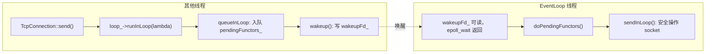


## 4.Acceptor从初始化到创建一个新连接的过程

#### 第一步：构造 Acceptor

```cpp
Acceptor::Acceptor(EventLoop* loop, const InetAddress& listenAddr, bool reuseport)
    : loop_(loop),
      acceptSocket_(::socket(AF_INET, SOCK_STREAM | SOCK_NONBLOCK | SOCK_CLOEXEC, 0)),
      acceptChannel_(loop, acceptSocket_.fd()),
      listenning_(false) {
  acceptSocket_.setReuseAddr(true);
  acceptSocket_.setReusePort(reuseport);
  acceptSocket_.bindAddress(listenAddr);
  acceptChannel_.setReadCallback(std::bind(&Acceptor::handleRead, this));
}
```

构造时做了三件事：
1. 创建监听 socket（`SOCK_NONBLOCK` 非阻塞，`SOCK_CLOEXEC` exec 时自动关闭）
2. 用监听 socket 的 `fd` 创建 `acceptChannel_`，绑定到所属 EventLoop
3. 将 `handleRead` 注册为 `acceptChannel_` 的读事件回调，但<u>此时还未开启监听</u>

#### 第二步：调用 listen()

```cpp
void Acceptor::listen() {
  listenning_ = true;
  acceptSocket_.listen();
  acceptChannel_.enableReading();
}
```

`acceptChannel_.enableReading()` 会触发第 1 节中描述的注册链，将监听 socket 加入 epoll。<span style="color:dodgerblue">从这一刻起 Acceptor 准备完成，EventLoop 开始等待新连接到来。</span>

#### 第三步：新连接到达，触发 handleRead

epoll 检测到监听 socket 可读（即有新连接请求），EventLoop 调用 `acceptChannel_.handleEvent()`，进而触发注册的读回调：

```cpp
void Acceptor::handleRead() {
  InetAddress peerAddr;
  int connfd = acceptSocket_.accept(&peerAddr);
  if (connfd >= 0) {
    if (newConnectionCallback_) {
      newConnectionCallback_(connfd, peerAddr);  // 把已连接 fd 交给上层
    } else {
      ::close(connfd);
    }
  }
}
```

`accept()` 返回的 `connfd` 是与客户端建立好的已连接 socket，<u>与监听 socket 完全独立</u>。<span style="color:dodgerblue">Acceptor 自身不管理这个 fd，直接通过 `newConnectionCallback_` 交给上层处理。</span>

#### 第四步：上层创建 TcpConnection

在 `main.cpp` 中，`newConnectionCallback_` 被设置为：

```cpp
acceptor.setNewConnectionCallback([&](int connfd, const InetAddress& peerAddr) {
  auto conn = std::make_shared<TcpConnection>(&loop, connName, connfd, localAddr, peerAddr);
  // 注册业务回调...
  connections[connName] = conn;
  conn->connectEstablished();
});
```

`TcpConnection` 构造时为 `connfd` 创建一个新的 `Channel`，并挂载读写、关闭、错误四个回调。调用 `connectEstablished()` 后，连接正式激活：

```cpp
void TcpConnection::connectEstablished() {
  state_ = StateE::kConnected;
  channel_->tie(shared_from_this());  // 防止事件处理期间 TcpConnection 被析构
  channel_->enableReading();          // 将已连接 socket 注册到 epoll
  if (connectionCallback_) connectionCallback_(shared_from_this());
}
```

`channel_->tie()` 的作用：Channel 内部用 `weak_ptr` 保存 TcpConnection 的引用，每次 `handleEvent` 时尝试提升为 `shared_ptr`。<u>若提升失败，说明 TcpConnection 已析构</u>，则跳过回调，<span style="color:crimson">避免访问已释放内存（use-after-free）</span>。

#### 整体调用链

```mermaid
flowchart LR
    subgraph init["初始化阶段"]
        A["main() 构造 Acceptor<br/>注册 newConnectionCallback_"] --> B["acceptor.listen()"]
        B --> C["acceptChannel_.enableReading()<br/>监听 socket 加入 epoll"]
    end
    subgraph conn["新连接到达"]
        D["EventLoop::loop()<br/>epoll_wait 返回，acceptChannel_ 活跃"] --> E["acceptChannel_.handleEvent()"]
        E --> F["Acceptor::handleRead()"]
        F --> G["accept() 得到 connfd"]
        G --> H["newConnectionCallback_(connfd, peerAddr)"]
        H --> I["创建 TcpConnection"]
        I --> J["connectEstablished()"]
        J --> K["channel_->enableReading()<br/>已连接 socket 加入 epoll"]
    end
    C -.有新连接请求.-> D
```

至此，新连接的 Channel 已注册到 EventLoop，<span style="color:dodgerblue">后续客户端发来的数据会直接触发 `TcpConnection::handleRead()`</span>。


****

## 5.为什么需要EventLoopThread相关部分呢？

### EventLoopThread的意义

首先看看EventLoopThread的设计，构造函数比较简单

```cpp
using ThreadInitCallback = std::function<void(EventLoop*)>;

EventLoopThread::EventLoopThread(const ThreadInitCallback& cb, const std::string& name)
    : loop_(nullptr), exiting_(false),
      thread_(std::bind(&EventLoopThread::threadFunc, this), name),
      callback_(cb) {}
```

 就是给这个线程设置好任务函数、回调函数和线程的名字，没什么特别的

那么关键就是在于`threadFunc`和`startloop`这两个**核心功能函数**

先看threadFunc的定义

```cpp
void EventLoopThread::threadFunc() {
  EventLoop loop;
  if (callback_) callback_(&loop);
  {
    std::lock_guard<std::mutex> lock(mutex_);
    loop_ = &loop;
    condVar_.notify_one();
  }
  loop.loop();
}
```

在EventLoop线程类构造的时候就配置好了线程函数，流程如下：

1. 初始化一个EventLoop对象
2. 如果设置了回调，那么就执行回调
3. 进入临界区，需要锁进行保护
   - 将loop的地址设置好（作用何在）
   - 唤醒一个等待loop对象的地方
4. 事件循环开始

是不是感觉设计很迷惑，明明我们的核心目的就是让事件循环开始，别的地方能够拿到指针就可以了，为什么需要notify_one呢？

先别急，接着往下看startloop的设计

```cpp
EventLoop* EventLoopThread::startLoop() {
  thread_.start();
  EventLoop* loop = nullptr;
  {
    std::unique_lock<std::mutex> lock(mutex_);
    while (loop_ == nullptr) condVar_.wait(lock);
    loop = loop_;
  }
  return loop;
}

```

这是一个供外部调用的方法，具体逻辑如下

1. 启动任务线程，然后返回
   - 也就是`threadFunc`
2. 然后轮询检查loop_是否被设置
   - 没有被设置，休眠
   - 被设置了，那么就存储loop的地址
3. 返回创建的loop的地址

这个函数的作用就是启动一个执行EventLoop事件循环的线程，然后将EventLoop对象的地址返回给外界，方便外部向事件循环中注册新的channel和添加任务。

所以这里就可以懂得`notify_one`和`wait`的意义了，如同下图所示：

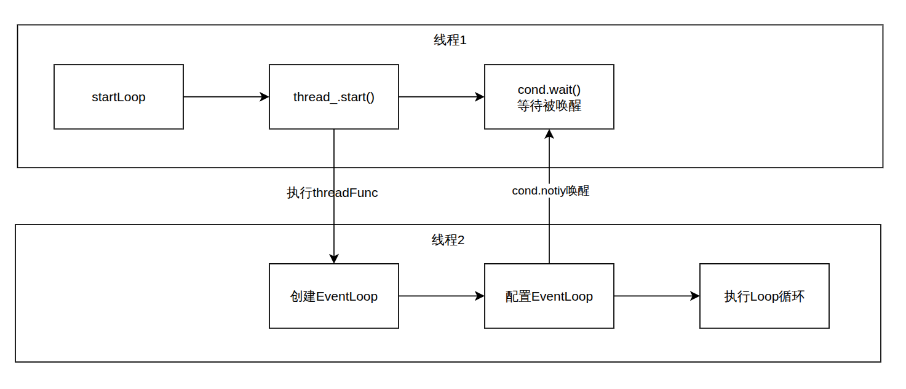

如果没有 notify 和 wait 的配合，<span style="color:crimson">就只能在原地忙等（busy-wait）轮询 `loop_`，白白浪费 CPU</span>。

> 那么为什么 `while (loop_ == nullptr) condVar_.wait(lock);` 用 while 而不用 if 呢？
>
> 原因在于<u>防止**假唤醒**</u>：条件变量在某些操作系统实现下，即使没人调用 `notify`，`wait` 也可能自己醒来。用 while 在每次醒来后重新校验条件，假唤醒就继续等，不会误以为 `loop_` 已就绪。

<span style="color:dodgerblue">总结来看，EventLoopThread 的核心意义在于把 EventLoop 包装成一个 RAII 结构，方便地创建、启动和析构一个 EventLoop 循环，降低管理多线程 EventLoop 的复杂度。</span>


### EventLoopThreadPool的作用

根据这个类的命名就能够分析出这个是用来管理多个事件循环线程的线程池，但显然绝对不可能仅仅负责多个EventLoop线程的创建和销毁。

来看看这个类的设计，首先是构造函数

```cpp
EventLoopThreadPool::EventLoopThreadPool(EventLoop* baseLoop, const std::string& name)
    : baseLoop_(baseLoop), name_(name), started_(false), numThreads_(0), next_(0) {}
```

你会意识到，明明管理多个EventLoop线程的线程池，构造的时候反而需要一个BaseLoop,这是为什么呢？这里先按下不表，接着往后看

看start函数定义

```cpp
void EventLoopThreadPool::start(const ThreadInitCallback& cb) {
  started_ = true;
  for (int i = 0; i < numThreads_; ++i) {
    std::string threadName = name_ + std::to_string(i);
    auto* t = new EventLoopThread(cb, threadName);
    threads_.emplace_back(t);
    loops_.push_back(t->startLoop());
  }
}
```

创建**numThreads**个**EventLoop**，将**EventLoopThreads**通过emplace_back构造并存储在threads，以便在结束时自动析构，同时调用**t->startloop（）**启动事件循环，同时将指针存储到loops_中，便于后续使用

这个很好理解，构建并存储几个线程而已。

那么**baseLoop_**的作用究竟在哪儿呢？答案在两个函数

```cpp
EventLoop* EventLoopThreadPool::getNextLoop() {
  EventLoop* loop = baseLoop_;
  if (!loops_.empty()) {
    loop = loops_[next_];
    if (++next_ >= static_cast<int>(loops_.size())) next_ = 0;
  }
  return loop;
}

std::vector<EventLoop*> EventLoopThreadPool::getAllLoops() {
  if (loops_.empty()) return {baseLoop_};
  return loops_;
}
```

这两个函数都要区分 `loops_` 是否为空两种情况：

- **`loops_` 非空（多线程模式）**：`getNextLoop()` 以轮询（round-robin）方式**不断从线程池中取出下一个可用的 EventLoop**，把连接均摊到各个 IO 线程上，不过这里只是简单轮询，没有做基于负载的均衡。
- **`loops_` 为空（单线程模式）**：直接返回 `baseLoop_`，给出一个可用的**单线程事件循环**（其实就是退化成了单线程），而这个 loop 正是构造时传入的 **baseLoop_**。

这就是 `baseLoop_` 存在的意义：<span style="color:dodgerblue">当线程数为 0 时，它作为兜底的 EventLoop，让上层代码无需区分单 / 多线程即可统一使用 `getNextLoop()`。</span>

>  需要注意的是，轮询只负责分配，并不保证拿到的连接在事件处理期间一直存活。当 EventLoop 正在分发某个 Channel 的回调时，可能有其他路径把对应的 TcpConnection 析构掉，导致 use-after-free。为此 Channel 在 handleEvent 中用 tie_ 做了一道保护：
>
> ```cpp
> void Channel::handleEvent(Timestamp receiveTime) {
>   if (tied_) {
>     std::shared_ptr<void> guard = tie_.lock();	// 提升 weak_ptr，确认 TcpConnection 仍存活
>     if (guard)
>       handleEventWithGuard(receiveTime);        // 提升成功，回调期间 guard 保证对象不被析构
>   } else {
>     handleEventWithGuard(receiveTime);
>   }
> }
> ```
>
> `tie_` 是一个 `weak_ptr<void>`，在 `connectEstablished()` 里通过 `channel_->tie(shared_from_this())` 绑定到所属的 TcpConnection。`lock()` 检查的是 **TcpConnection 本身是否还活着**（而非 EventLoop 或线程），提升出的 `guard` 在整个回调执行期间持有一份额外的 `shared_ptr`，确保对象不会在回调中途被销毁。


综上所述，EventLoopThreadPool 的核心意义在于三点：

1. **多线程 IO**：创建若干个独立的 IO 线程（每个线程持有一个 EventLoop），让多条连接可以并行处理读写，避免单线程成为瓶颈。
2. **轮询分配**：通过 `getNextLoop()` 以 round-robin 方式将连接分配给不同的 IO 线程，实现简单的负载分散。
3. **单线程退化**：当 `numThreads_ == 0` 时，`getNextLoop()` 直接返回 `baseLoop_`，整个服务器退化为单 Reactor 单线程模式，上层代码无需任何改动。


## 6. TcpConnection 的设计

### 先理清：TcpConnection 绑定在哪个线程上？

TcpConnection 自己**不创建、也不拥有** EventLoop。它在构造时由外部传入一个 `EventLoop*`，存为成员 `loop_`：

```cpp
TcpConnection::TcpConnection(EventLoop* loop, std::string name, int sockfd, ...)
    : loop_(loop), ... {}
```

这个 `loop_` 就是这条连接的"归属线程"。整个类有一条贯穿始终的约定：

> TcpConnection 的所有成员——`channel_`、`inputBuffer_`、`outputBuffer_`、socket 读写，以及 handleRead / handleWrite / handleClose / handleError 这四个回调——<u>都只在 `loop_` 所属的那个线程上执行</u>。

正因如此，这些成员<span style="color:dodgerblue">不需要任何锁</span>：同一时刻只会有 `loop_` 这一个线程去碰它们。这也是后面频繁出现 **sendInLoop**、**shutdownInLoop** 这种 `xxxInLoop` 命名的原因——带 `InLoop` 后缀的函数都隐含<u>必须在 `loop_` 线程里执行</u>这一前提。

至于这个 `loop_` 由谁传进来、程序里到底有几个 EventLoop、一条连接是怎么被分到某个 loop 上的，这些都是更上层（线程池、以及之后会讲的服务器入口）的职责，TcpConnection 本身并不关心。这里只需记住一句话：<span style="color:dodgerblue">一条 TcpConnection 从生到死都钉在 `loop_` 这一个线程上</span>。

### TcpConnection 的生命周期与状态机

TcpConnection 有四个状态，贯穿整个连接的生命周期：

```
kConnecting → kConnected → kDisconnecting → kDisconnected
```

- **kConnecting**：TcpConnection 刚被构造，socket 已 accept 但 `connectEstablished()` 尚未调用。
- **kConnected**：`connectEstablished()` 执行完毕，Channel 已注册到 epoll，连接正式激活。
- **kDisconnecting**：调用了 `shutdown()`，等待 `outputBuffer_` 发送完毕后再真正关闭写端。
- **kDisconnected**：`handleClose()` 或 `connectDestroyed()` 执行后，Channel 从 epoll 摘除。

状态只在 <u>IO 线程（`loop_` 所属线程）上流转，因此无需加锁</u>。


### 为什么 TcpConnection 要继承 enable_shared_from_this？

TcpConnection 在三个地方会被持有：TcpServer 的 `connections_` 表、Channel 注册的各个回调 lambda、用户的业务回调。这三者的生命周期各不相同，因此 TcpConnection 必须以 `shared_ptr` 的形式共享所有权。

`enable_shared_from_this` 的作用是让对象在成员函数内部安全地获取指向自身的 `shared_ptr`，而不是用 `this` 裸指针：

```cpp
// 投递给 IO 线程时，捕获 shared_ptr 而非 this，防止任务执行前对象被析构
loop_->runInLoop([self = shared_from_this(), message]() {
    self->sendInLoop(message);
});
```

如果捕获 `this`，<span style="color:crimson">任务在队列里等待期间 `TcpConnection` 可能已被销毁，执行时就会访问悬空指针</span>。


### 关于TcpConnection的数据发送

连接建立和销毁的 `connectEstablished` / `connectDestroyed` 由外部控制；而 handleRead、handleWrite、handleClose、handleError 只是注册给 Channel 的四个回调，处理一条 TCP 连接的基础读写事件：

```cpp
channel_->setReadCallback([this](Timestamp t) { handleRead(t); });
channel_->setWriteCallback([this]() { handleWrite(); });
channel_->setCloseCallback([this]() { handleClose(); });
channel_->setErrorCallback([this]() { handleError(); });
```

<span style="color:dodgerblue">真正值得细看的是数据的发送</span>——接收是被动的（epoll 报告可读后由 `handleRead` 读入），而发送要自己处理<u>"一次写不完"</u>的情况。

首先看 `send` 的定义：

```cpp
void TcpConnection::send(const std::string& message) {
  if (state_ == StateE::kConnected) {
    if (loop_->isInLoopThread())
      sendInLoop(message);
    else
      loop_->runInLoop([self = shared_from_this(), message]() { self->sendInLoop(message); });
  }
}
```

逻辑如下：

1. 判断当前的Tcp状态，如果已经建立连接`StateE::kConnected`才会执行后续操作
2. 判断当前的工作线程
   1. 如果当前在EventLoop的线程中，那么则调用**sendInLoop(message)**立刻发送数据
   2. 如果不在EventLoop线程，那么则调用**runInLoop**将当前的数据发送操作任务放入EventLoop的任务队列中

为什么会需要这个判断呢？这里先按下不表，先看看sendInLoop的定义

```cpp
void TcpConnection::sendInLoop(const std::string& message) {
  ssize_t nwrote = 0;
  size_t remaining = message.size();
  bool faultError = false;

  // 连接已断开，放弃发送
  if (state_ == StateE::kDisconnected) {
    LOGERROR("TcpConnection::sendInLoop() disconnected, give up writing");
    return;
  }

  // 如果没有正在写且输出缓冲区没有待发送数据，尝试直接写入 socket
  if (!channel_->isWriting() && outputBuffer_.readableBytes() == 0) {
    // 直接写入数据到 socket，减少一次内核拷贝
    nwrote = ::write(channel_->fd(), message.data(), message.size());
    if (nwrote >= 0) {
      remaining = message.size() - static_cast<size_t>(nwrote);
      if (remaining == 0 && writeCompleteCallback_)
        loop_->queueInLoop([self = shared_from_this()] { self->writeCompleteCallback_(self); });
    } else {
      nwrote = 0;
      if (errno != EWOULDBLOCK) {
        LOGERROR("TcpConnection::sendInLoop() write error: {}", errno);
        if (errno == EPIPE || errno == ECONNRESET)
          faultError = true;
      }
    }
  }

  // 检查是否有剩余数据需要发送，或之前写入时发生了错误
  if (!faultError && remaining > 0) {
    const size_t oldLen = outputBuffer_.readableBytes();
    if (oldLen + remaining >= highWaterMark_ && oldLen < highWaterMark_ && highWaterMarkCallback_) {
      loop_->queueInLoop([self = shared_from_this(), len = oldLen + remaining] {
        self->highWaterMarkCallback_(self, len);
      });
    }
    outputBuffer_.append(message.data() + nwrote, remaining);
    if (!channel_->isWriting())
      channel_->enableWriting();
  }
}
```

逻辑如下：

1. 检查连接状态
2. 判断channel和outputbuffer状态，是否可以进行写操作
3. 向channel对应socket的fd写入message数据
   1. 如果写入成功且全部写完，那么就将**写完回调放入Loop的任务队列中**
   2. 如果写入不成功，错误处理
4. 如果有剩余数据没发送完
   1. 检查outputbuffer中目前的数据量
   2. 如果要发送的总数据量超过高水位，但是已有数据量尚未超过高水位，那么就向EventLoop的任务队列中添加高水位处理任务
   3. 然后将message中尚未发送的数据添加进outputbuffer
   4. 将channel的状态设置为可写入，等待EventLoop的Epoller监控到channel可写时调用handleWrite完成剩下的写入


#### 回到前面的疑问：为什么 send 要判断线程？

现在可以回答 `send()` 里那个 `isInLoopThread()` 判断的意义了。

关键前提是 **one loop per thread**：每个 TcpConnection 都归属于某个固定的 IO loop（`loop_`），它的 `channel_`、`outputBuffer_`、socket 这些成员**没有任何加锁保护**，约定上只能由 `loop_` 所属的那个线程访问。

而 `send()` 是暴露给用户的公开接口，**任何线程都可能调用它**。常见的两种情形：

- 在 `messageCallback_` 里直接 `conn->send(resp)`——此时本来就在 IO loop 线程，`isInLoopThread()` 为 true，直接调 `sendInLoop` 即可。
- 在用户自己的工作线程里算完结果后 `conn->send(result)`——此时不在 IO loop 线程，`isInLoopThread()` 为 false。

如果第二种情形也直接调 `sendInLoop`，<span style="color:crimson">就会有两个线程同时操作同一个 `outputBuffer_`，造成数据竞争</span>。所以这里通过 `runInLoop` 把发送任务投递回 `loop_` 所属线程，<u>保证 `sendInLoop` 永远只在那一个线程里执行</u>——这样无需加锁也能线程安全。这正是第 3 节"何时需要跨线程操作"在 TcpConnection 上的具体应用。


#### 没写完的数据：handleWrite 续写

`sendInLoop` 里如果数据没一次写完，会把剩余部分留在 `outputBuffer_` 并 `enableWriting()`。之后 socket 缓冲区腾出空间变为可写时，epoll 通知 EventLoop，触发 `handleWrite()` 继续把剩余数据写出去：

```cpp
void TcpConnection::handleWrite() {
  int savedErrno = 0;
  const ssize_t n = outputBuffer_.writeFd(channel_->fd(), &savedErrno);
  if (n > 0) {
    if (outputBuffer_.readableBytes() == 0) {   // 缓冲区清空，发送完毕
      channel_->disableWriting();               // 关闭写监听，避免 epoll 空转
      if (writeCompleteCallback_)
        writeCompleteCallback_(shared_from_this());
      if (state_ == StateE::kDisconnecting)      // 之前调过 shutdown，等发完再真正关
        shutdownInLoop();
    }
  } else {
    errno = savedErrno;
    LOGERROR("TcpConnection::handleWrite() error");
    handleError();
  }
}
```

注意 `disableWriting()` 这一步很关键：写事件是 **电平触发（LT）**，只要 socket 可写就会一直通知。<span style="color:crimson">如果数据已经发完还不关闭写监听，epoll 会反复唤醒造成 CPU 空转</span>。所以 <u>"发不完才开写监听、发完立即关"</u> 是这里的核心节奏。

至此发送流程才算闭环：

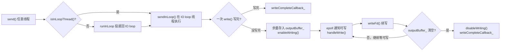

#### 连接关闭流程

被动关闭由对端发来 FIN 触发：epoll 把它识别为可读事件，`handleRead()` 读到 0 字节后转入 `handleClose()`：

```cpp
void TcpConnection::handleClose() {
  state_ = StateE::kDisconnected;
  channel_->disableAll();        // 从 epoll 摘除所有事件
  channel_->remove();            // 从 Poller 的 channels_ 表中删除
  if (connectionCallback_)
    connectionCallback_(shared_from_this());  // 通知用户连接断开
  if (closeCallback_)
    closeCallback_(shared_from_this());       // 通知 TcpServer 移除连接记录
}
```

`handleClose()` 做的都是 TcpConnection 自己这一侧的收尾：把状态置为 `kDisconnected`、把 `channel_` 从所属 loop 的 epoll 里摘掉，再通过两个回调向外通报。

这里的关键在于 TcpConnection **不负责销毁自己**。前面说过，它的生命周期由外部持有者（构造时传入 `loop_`、并持有它 `shared_ptr` 的那个上层，之后会讲到的服务器入口）掌管。所以它能做的只是触发 `closeCallback_`，告诉持有者"我这条连接要关了，请把你手里指向我的那份引用去掉"。`closeCallback_` 的具体内容由持有者在创建连接时注册，这里不展开。

为什么不在 `handleClose()` 里直接把自己删掉？因为此刻正运行在 `channel_->handleEvent()` 内部——也就是说，正踩在自己的 Channel 上执行回调。<span style="color:crimson">如果这时把 TcpConnection（连同它的 `channel_`）销毁，函数返回后 `handleEvent` 还要继续访问已释放的 `channel_`，就是 use-after-free</span>。所以 <u>销毁动作必须延后</u>：先通知持有者解除引用，等真正没人用了再析构。

最后真正的清理落在 `connectDestroyed()`：

```cpp
void TcpConnection::connectDestroyed() {
  if (state_ != StateE::kDisconnected) {   // 幂等保护，重复调用不出错
    state_ = StateE::kDisconnected;
    channel_->disableAll();
    channel_->remove();
    if (connectionCallback_)
      connectionCallback_(shared_from_this());
  }
}
```

它和 `handleClose` 都会 `disableAll/remove`，看似重复，其实是为了覆盖两条不同的关闭路径：

- **被动关闭**：对端断开 → `handleClose()` 已经摘除过 channel，`connectDestroyed` 走到时 `state_` 已是 `kDisconnected`，靠开头的 `if` 跳过，不重复操作。
- **主动关闭**：持有者主动结束连接时直接调 `connectDestroyed()`，没经过 `handleClose`，这时就由它来完成摘除。

<span style="color:dodgerblue">幂等保护（`state_ != kDisconnected`）保证了无论哪条路径、调用几次都安全。</span>

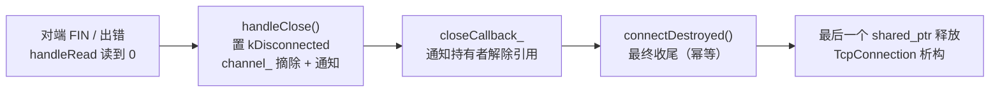

> 注意整条链路里"持有者怎么解除引用、为什么中间还要在不同线程之间倒手"涉及上层服务器的设计，等讲到那部分再补。这里只需记住 TcpConnection 自己的责任边界：<span style="color:dodgerblue">摘掉自己的 channel、发出关闭通知，但把真正的销毁交给持有者，并用"延后 + 幂等"避免在事件处理途中自毁。</span>


## 7. 组件的集合体TcpServer

这是聚合了整个服务器组件的核心，也是外部常用的主要类。所以需要详细解构这个类的设计。

先简单看看对象的成员变量

```cpp
 private:
  /** @brief main loop，运行 Acceptor。 */
  EventLoop*   loop_;
  /** @brief 服务器名称。 */
  const std::string name_;
  /** @brief 监听地址字符串，用于连接命名。 */
  const std::string ipPort_;

  /** @brief 监听 socket 的封装，负责 accept 新连接。 */
  std::unique_ptr<Acceptor>             acceptor_;
  /** @brief IO 线程池，持有所有 IO EventLoop。 */
  std::shared_ptr<EventLoopThreadPool>  threadPool_;

  ConnectionCallback    connectionCallback_;    ///< 连接建立/断开回调
  MessageCallback       messageCallback_;       ///< 数据可读回调
  WriteCompleteCallback writeCompleteCallback_; ///< 写完成回调
  ThreadInitCallback    threadInitCallback_;    ///< IO 线程初始化回调

  /** @brief start() 是否已执行的原子标志，防止重复启动。 */
  std::atomic<int> started_;
  /** @brief 自增连接 ID，用于生成唯一连接名称。 */
  int              nextConnId_;
  /** @brief 已建立的所有连接，以连接名称为 key。 */
  std::unordered_multimap<std::string, TcpConnectionPtr> connections_;
```

然后就从基本的构造函数开始，看看如何构造一个TcpServer类所需要的成员变量

```cpp
TcpServer::TcpServer(EventLoop* loop, const InetAddress listenAddr, std::string name, Option option)
    : loop_(loop),
      name_(std::move(name)),
      ipPort_(listenAddr.toIpPort()),
      acceptor_(std::make_unique<Acceptor>(loop, listenAddr, option == kReusePort)),
      threadPool_(std::make_shared<EventLoopThreadPool>(loop, name_)),
      started_(0),
      nextConnId_(1) {
  acceptor_->setNewConnectionCallback(
      [this](int sockfd, const InetAddress& peerAddr) { newConnection(sockfd, peerAddr); });
}
```

构造好相关的对象后，会进行`acceptor`新连接回调函数的配置。

这个回调函数很简单：即当`acceptor`接受到新的连接后会调用**newConnection**函数，这个函数如下所示

```cpp
void TcpServer::newConnection(int sockfd, const InetAddress& peerAddr) {
  EventLoop* ioLoop = threadPool_->getNextLoop();
  const InetAddress localAddr = getLocalAddr(sockfd);
  const std::string connName = name_ + "#" + ipPort_ + "#" + std::to_string(nextConnId_++);

  LOGINFO("TcpServer [{}] new connection [{}] from {}", name_, connName, peerAddr.toIpPort());

  auto conn = std::make_shared<TcpConnection>(ioLoop, connName, sockfd, localAddr, peerAddr);
  connections_.emplace(connName, conn);
  conn->setConnectionCallback(connectionCallback_);
  conn->setMessageCallback(messageCallback_);
  conn->setWriteCompleteCallback(writeCompleteCallback_);
  conn->setCloseCallback([this](const TcpConnectionPtr& c) { removeConnection(c); });
  ioLoop->runInLoop([conn] { conn->connectEstablished(); });
}
```

这个函数的逻辑如下所示：

1. 从threadPool_中拿取一个EventLoop线程
2. 基于EventLoop线程构造一个TcpConnection
   - 将这个TcpConnection绑定到一个ioLoop上，监听sockfd的动作，然后记下本端和对端的IP和端口号
   - 需要说明的是sockfd是acceptor和对端建立连接后创建的文件描述符（fd）用来进行两端的网络数据的收发
3. 将TcpConnection放入connections（map）中进行管理
4. 配置TcpConnection的回调函数
5. 执行Tcp的连接建立回调函数（就一般而言，这里不会在TcpConnection所处的线程，这个回调任务应该会加入到回调队列，交由TcpConnection所处的线程执行）


所以`构造函数`配合`newConnection`函数，使得TcpServer具备了相关组件的同时，也让acceptor能够在接受到新的连接请求后，自动从Server所管理的线程池获取一个线程构造一个TcpConnetion对象负责新的Tcp连接。

****

说完构造函数，接下来就是一个比较常用的函数，start函数

```cpp
void TcpServer::start() {
  int expected = 0;
  if (started_.compare_exchange_strong(expected, 1)) {
    threadPool_->start(threadInitCallback_);
    loop_->runInLoop([this] { acceptor_->listen(); });
  }
}
```

关于第一个判定的意义是

- 如果started已经被设置为1（开始），那么就跳过后续操作
- 如果started被设置为0（尚未开始），那么就执行初始化操作

> 关于`compare_exchange_strong`的函数，声明如下
>
> ```cpp
> bool compare_exchange_strong(
>     T& expected,
>     T desired,
>     std::memory_order success,
>     std::memory_order failure
> );
> ```
>
> 这个函数等价于以下操作：
>
> ```cpp
> if (atomic_value == expected) {
>     atomic_value = desired;
>     return true;
> } else {
>     expected = atomic_value;
>     return false;
> }
> ```
>
> 即一个**比较并交换的操作（CAS）**：如果原子变量当前值等于 `expected`，则原子地写入 `desired` 并返回 `true`；否则把实际值写回 `expected`，返回 `false`。

那么为什么不使用以下的操作逻辑呢

```cpp
if(started_ == 0){
    //初始化操作
    started_ =1;
}
```

虽然原子变量started\_的“==”操作和“=”操作都被重载成原子操作，不会被多线程调用而出现异常，但是中间从 if(started_ == 0) -> started_ =1;操作为止，都不是原子也没有锁的，因此如果出现两个线程在时间差距不大的时间段，先后执行了if(started_ == 0)判断，如果此时第一个执行的线程尚未完成started_ = 1这一步骤时，那么就会同时出现两个线程都通过started_ == 0的判断，那么就会造成无法预料的结果。

其他初始化操作就没什么好说的了。

****

构造、newConnection、start 串起了"连接从无到有"的链路，还剩**连接消亡**这一段没讲——这正是前面 TcpConnection 关闭流程里留下的伏笔：`handleClose()` 只把自己这侧收尾，真正的销毁"交给持有者"。这个**持有者**就是 TcpServer，而它解除引用的入口是 `removeConnection`。

回看 newConnection 里注册的那行：`conn->setCloseCallback([this](const TcpConnectionPtr& c) { removeConnection(c); });`。当某条连接断开、`handleClose()` 触发 `closeCallback_` 时，最终调到的就是下面这对函数：

```cpp
void TcpServer::removeConnection(const TcpConnectionPtr& conn) {
  loop_->runInLoop([this, conn] { removeConnectionInLoop(conn); });
}

void TcpServer::removeConnectionInLoop(const TcpConnectionPtr& conn) {
  LOGINFO("TcpServer [{}] remove connection [{}]", name_, conn->getName());
  connections_.erase(conn->getName());
  conn->getLoop()->runInLoop([conn] { conn->connectDestroyed(); });
}
```

为什么要拆成 `removeConnection` 和 `removeConnectionInLoop` 两个？因为 `connections_` 这张 map 是 TcpServer 的成员，<u>只能在 main loop（`loop_`）线程里被读写</u>。而 `closeCallback_` 是在连接自己的 **ioLoop** 线程触发的，跨线程直接 `erase` 就会和 main loop 产生数据竞争。所以 `removeConnection` 先用 `runInLoop` 把活儿投递回 `loop_` 线程，真正的 `erase` 放在 `removeConnectionInLoop` 里执行——<span style="color:dodgerblue">这正是第 3 节"何时需要跨线程操作"在 TcpServer 上的又一次应用。</span>

`erase` 之后，map 里那份指向连接的 `shared_ptr` 就没了，但 lambda 按值捕获的 `conn` 还攥着一份引用，对象不会立刻析构。紧接着 `conn->getLoop()->runInLoop(...)` 又把 `connectDestroyed()` 投递回连接**自己的 ioLoop** ——因为 `connectDestroyed` 要碰 `channel_`，<u>必须回到连接所属的那个线程</u>执行。

于是整条关闭链路在线程间倒了两手：

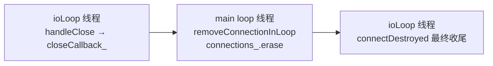

<span style="color:dodgerblue">这就补上了 TcpConnection 那节欠下的答案：持有者就是 TcpServer，"解除引用"就是从 `connections_` 里 `erase`，"不同线程之间倒手"就是 ioLoop → main loop → ioLoop 这一来一回。</span>

****

最后看析构函数。服务器关停时，`connections_` 里可能还挂着没断开的连接，得逐个清理：

```cpp
TcpServer::~TcpServer() {
  for (auto& [name, conn] : connections_) {
    TcpConnectionPtr localConn(conn);
    conn.reset();
    localConn->getLoop()->runInLoop([localConn] { localConn->connectDestroyed(); });
  }
}
```

逻辑和上面的 remove 同源：每条连接的 `connectDestroyed()` 都得回到<u>它自己的 ioLoop 线程</u>去执行，而不是在析构 TcpServer 的这个线程里直接调。区别在于此处正在遍历 map，<u>不能在迭代途中 `erase`</u>，所以用 `conn.reset()` 释放 map 这份引用，语义上对齐正常路径里的 `erase`（"map 先放手"）；`localConn` 则把连接的生命续到 lambda 执行完。

这里有一条不能踩的线：lambda 必须 <span style="color:crimson">按值捕获 `[localConn]`，绝不能写成 `[&conn]`——`conn` 是 map 元素的引用，析构函数返回后 map 就没了，引用随之悬空，等 ioLoop 真正执行任务时就是悬空访问。</span>按值复制一份 `shared_ptr`，才能把对象的生命安全地延续到任务执行的那一刻。

> 严格说 `conn.reset()` 对正确性并非必需：即便不写，map 在析构函数返回时也会释放那份引用，引用计数走向完全一致，连接最终同样在 ioLoop 线程析构。它的价值是**可读性**——显式表达"所有权已从 map 转移给 lambda"，与正常断连路径 `connections_.erase` 在视觉上对齐。

至此 TcpServer 的责任边界就完整了：<span style="color:dodgerblue">对上聚合 Acceptor、线程池和所有连接并暴露 start 入口，对下在连接建立时分配 ioLoop、在连接消亡时跨线程倒手完成清理——它是把前面所有组件粘合成一个可用服务器的"集合体"。</span>


## 8. C++ 多线程模型与"线程归属"

前面 send、removeConnection、addTimer 反复出现"投递回所属线程"的套路，这一节把背后的原理单独抽出来讲清楚。

### 一个容易误解的前提：对象没有"线程归属"

在 C++ 标准多线程模型里，有一条容易想当然搞错的法则。假设线程 A 调用了"主要工作在线程 B"的某个对象的成员函数，那么：

> **这个成员函数会完完全全在调用者（线程 A）的上下文里执行，绝不会自动切换到对象的"所属线程"（线程 B）去运行。**

原因很简单：<span style="color:dodgerblue">在标准 C++ 层面，对象本身根本没有"线程归属"这个概念</span>。对象只是一块内存加上一组操作它的代码，只要线程 A 手里握着指向它的合法指针或引用，就能直接调用它的成员函数；CPU 不会、也无从知道"这个对象更应该由谁来碰"。

所谓"某对象归属某线程"，<u>完全是程序员人为约定出来的纪律，而非语言或运行时提供的保证</u>。本项目里的 "one loop per thread"、满屏的 `xxxInLoop` 后缀，全都是在维护这条约定。

### 问题：约定一旦被打破，就是数据竞争

麻烦也正出在这里。假设线程 B 正在读写某个对象的内部数据，与此同时线程 A 调用该对象的成员函数去改同一份数据——两个线程在没有任何同步的情况下并发访问同一块内存，这就是**数据竞争（data race）**，轻则数据错乱，重则触发未定义行为直接崩溃。

传统解法是**加锁**：给共享数据套上互斥量，谁碰谁先拿锁。但锁并非没有代价：

- **无竞争时**：获取/释放锁只是一两条原子指令，开销很小；
- **一旦发生竞争**：抢不到锁的线程会被挂起，<span style="color:crimson">引发线程阻塞与上下文切换，这部分代价远高于原子指令本身</span>；
- **隐性成本**：还要时刻提防死锁、锁顺序、临界区粒度等问题，<u>编程复杂度显著上升</u>。

### 本项目的选择：把任务送回它该待的线程

与其用锁去"保护"被多个线程争抢的数据，本项目走的是另一条路——<span style="color:dodgerblue">干脆不让多个线程争抢，让每份数据自始至终只被同一个线程访问</span>（即**线程封闭 / thread confinement**）。

落到代码上，就是 `EventLoop::runInLoop`：

```cpp
void EventLoop::runInLoop(const Functor& cb) {
  if (isInLoopThread())
    cb();              // 已在目标线程，直接执行
  else
    queueInLoop(cb);   // 不在，则入队并唤醒目标 EventLoop，防止任务堆积
}
```

它的判断只有两种走向：

- **调用方恰好就在目标 loop 线程**：没有任何竞争风险，直接执行回调；
- **调用方在别的线程**：不去碰目标线程的数据，而是把"想做的事"打包成任务投递过去，由目标 loop 线程在自己的循环里取出执行。

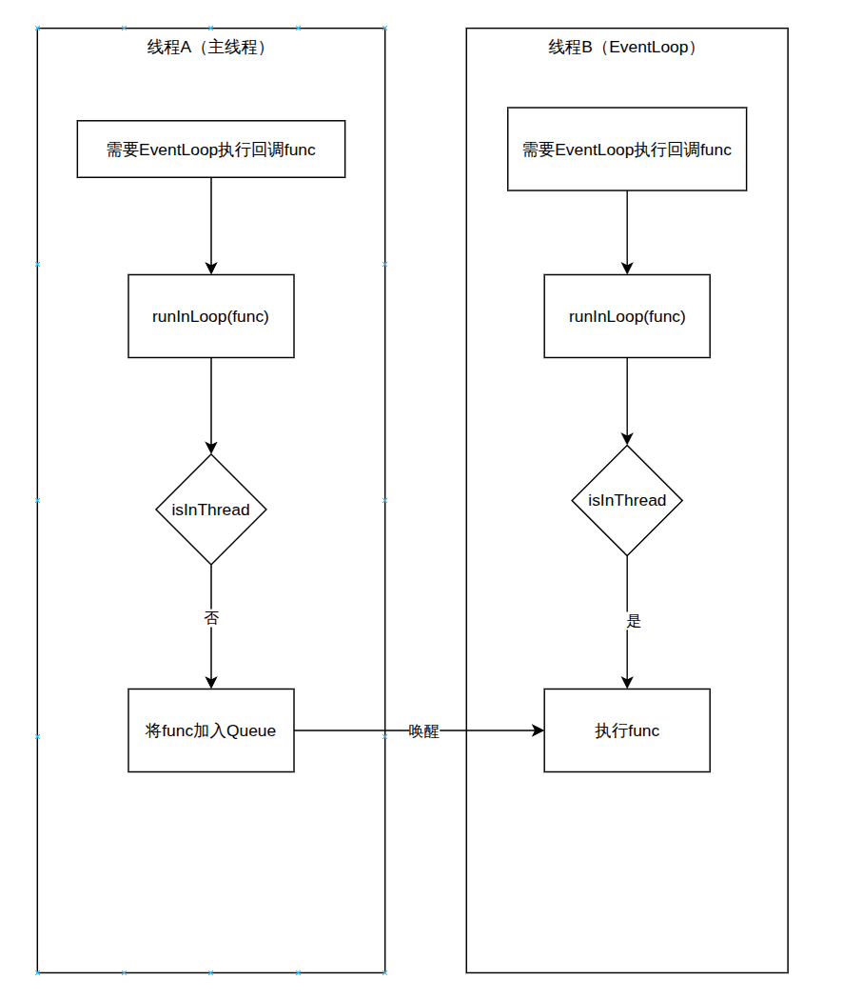

这样一来，目标对象的内部状态<u>永远只有它的所属线程在访问</u>，于是 `channel_`、`outputBuffer_`、`connections_`、定时器的 `timers_` 这些成员通通**不需要加锁**。

### 回头看：前面那些 `xxxInLoop` 都是这一招

这一节其实是把前面散落各处的同一个套路抽象出来——它们全是"runInLoop 投递回所属线程"的具体实例：

| 场景 | 公开接口（任意线程可调） | 投递回所属线程执行 |
|---|---|---|
| 发送数据 | `TcpConnection::send` | `sendInLoop` |
| 关闭写端 | `TcpConnection::shutdown` | `shutdownInLoop` |
| 移除连接 | `TcpServer::removeConnection` | `removeConnectionInLoop` |
| 增删定时器 | `TimerQueue::addTimer / cancel` | `addTimerInLoop / cancelInLoop` |

<span style="color:dodgerblue">用"线程封闭 + 任务投递"替代"共享数据 + 加锁"，既省掉了锁的运行时开销，又把多线程编程的复杂度压到最低——这正是整个 Reactor 框架能够保持内部无锁、逻辑清爽的根本原因。</span>


# 简单的Demo

代码如下所示

```cpp
int main() {
  EventLoop loop;
  InetAddress listenAddr(8888, "127.0.0.1");

  TcpServer server(&loop, listenAddr, "echo-server", kReusePort);
  server.setThreadNum(4);

  server.setConnectionCallback([](const TcpConnectionPtr& conn) {
    if (conn->isConnected()) {
      LOGINFO("[{}] connected from {}", conn->getName(), conn->getPeerAddr().toIpPort());
      conn->send("hello from echo-server\n");
    } else {
      LOGINFO("[{}] disconnected", conn->getName());
    }
  });

  server.setMessageCallback([](const TcpConnectionPtr& conn, Buffer* buf, Timestamp) {
    const std::string msg = buf->retrieveAsString(buf->readableBytes());
    LOGINFO("[{}] received {} bytes: {}", conn->getName(), msg.size(), msg);
    conn->send(msg);
  });

  server.start();
  LOGINFO("echo-server listening on {}", listenAddr.toIpPort());
  loop.loop();
  return 0;
}
```

 整体的执行逻辑如下所示

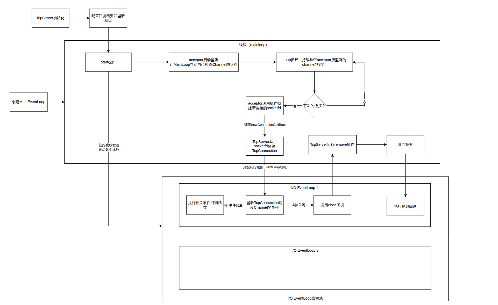

## 什么是Reactor网络模型

通过上述内容，现在可以对什么是Reactor网络模型进行描述了。

Reactor（反应堆）本质是一种**事件驱动**的网络编程模型：程序不主动阻塞去等某一个具体的 I/O，而是把一批 fd 各自关心的事件统一登记给操作系统的 I/O 多路复用机制（epoll），<u>哪个 fd 就绪就处理哪个</u>，处理完再回到等待。这个"等待事件 → 分发事件 → 处理事件"的循环，就是"反应"二字的由来。

经典 Reactor 模型有四个角色，正好和本项目的组件一一对应：

| Reactor 角色 | 职责 | 本项目对应 |
|---|---|---|
| 事件多路分发器(Demultiplexer) | 监听一批 fd，报告哪些就绪 | `EpollPoller`（epoll） |
| 反应堆(Reactor) | 驱动循环，拿到就绪事件后分发 | `EventLoop` |
| 事件处理器(Handler) | 持有 fd 及其各类事件的回调 | `Channel` |
| 具体处理器 | 实现具体业务逻辑 | `Acceptor`、`TcpConnection` |

把第 1、2 节串起来看：`EventLoop::loop()` 反复调用 `EpollPoller::poll()` 拿到就绪的 `Channel` 列表（activeChannels），再逐个调用 `channel->handleEvent()` 触发对应回调——<span style="color:dodgerblue">这就是一个最小的单 Reactor：一个线程、一个 EventLoop、一个 epoll，循环地分发并处理所有事件。</span>

但**单 Reactor 单线程**有个瓶颈：accept 新连接、读写已有连接的数据全挤在同一个线程里，<span style="color:crimson">一旦某个回调耗时较长，整个循环都会被卡住，其他连接的事件得不到及时处理。</span>

muduo 采用的是 **主从 Reactor（multiple Reactors）+ 线程池**模型来破解这个瓶颈，这也正是 TcpServer 把前面所有组件聚合起来的意义所在：

- **main Reactor**：只有一个，跑在主线程的 `loop_` 上，只伺候 `Acceptor` ——监听端口、accept 新连接。
- **sub Reactor**：由 `EventLoopThreadPool` 持有的 N 个 IO 线程，每个线程一个 EventLoop，各自管理一批 `TcpConnection` 的读写。

连接的流转：main Reactor 在 `Acceptor` 上 accept 到新连接后，经 newConnection 用 `getNextLoop()` 从线程池挑一个 sub Reactor，把新建的 `TcpConnection` 安置上去；此后这条连接的所有事件都由那个 sub Reactor 独立处理，<u>从生到死钉在同一个 IO 线程</u>，因而内部无需加锁。

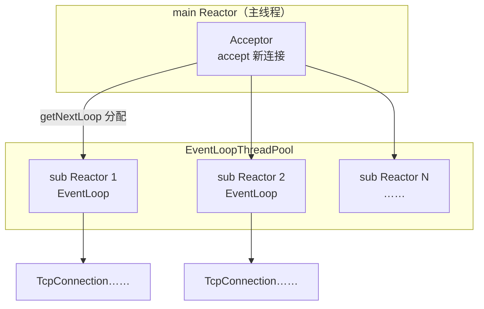

这样 accept 与数据读写就分摊到了不同线程：<span style="color:dodgerblue">main Reactor 专心接客、各 sub Reactor 各自处理连接 I/O，既保住了每个 EventLoop 内部无锁的简洁，又用多线程吃满多核——这便是本项目实现的 Reactor 网络模型全貌。</span>


# 进一步改进

## 1.Timer的设计

补全timestamp的能力，重载了几个运算符，负责时间标签的比较和运算。

然后是TimerId和Timer两个类的设计

首先看Timer类，这个类的职责主要是负责时间和回调函数的控制，主要对象如下

```cpp
class Timer{
 const TimerCallback callback_;  ///< 到期时执行的回调。
  Timestamp expiration_;          ///< 下次到期时刻；restart() 会修改，故非 const。
  const double interval_;         ///< 重复间隔（秒），<=0 表示一次性。
  const bool repeat_;             ///< 是否为周期定时器。
  const int64_t sequence_;        ///< 全局唯一自增序号。
  static std::atomic<int64_t> s_numCreated_;  ///< 生成 sequence_ 的全局原子计数器。
};
```

这个类的设计十分的简单，简单的计时器，每个计时器有唯一的sequence和回调函数

随后是TimerId类的设计，这个类的设计就更简单了

```cpp
class TimerId{
    private:
    Timer* timer_;      ///< 目标定时器指针，可能已失效，需配合 sequence_ 校验。
    int64_t sequence_;  ///< 目标定时器的全局唯一序号。
};
```

似乎觉得这个很多余，为什么要将Timer的Sequence和Timer指针都放在所谓的TimerId下呢，好处在什么地方？不过别急，接下来是比较关键的TimerQueue设计

先思考这个类的设计目的，即每过一段时间从Queue中取出到期的定时器，执行其中的回调函数，随后进行定时器的重置（或删除）。【还有取消定时器等等】

按照这个思路，我们看看这个类的设计吧。

```cpp
class TimerQueue{
    private:
    using Entry = std::pair<Timestamp, Timer*>;  ///< 主索引元素：按到期时间排序。
    using TimerList = std::set<Entry>;           ///< 按到期时间排序的定时器集合。

    EventLoop* loop_;                                   ///< 所属事件循环，不拥有其生命周期。
    const int timerfd_;                                 ///< timerfd_create 创建的定时器 fd。
    Channel timerfdChannel_;                            ///< 包装 timerfd_ 的 Channel，监听可读事件。
    TimerList timers_;                                  ///< 主索引：按到期时间排序，用于取最早。
    std::unordered_map<int64_t, Timer*> activeTimers_;  ///< 辅索引：sequence → Timer*，与 timers_ 一一对应，供 cancel。
    std::atomic<bool> callingExpiredTimers_;            ///< 是否正在执行到期回调，用于识别"回调内自注销"。

    std::unordered_set<int64_t> cancelingTimers_;  ///< 回调执行期间被请求取消的定时器 sequence，reset 时跳过不重新入队。
};
```

似乎会发觉存在两个列表，TimerList和activeTimers

- TimerList：存储过期时间 -> 计时器映射的有序集合
- activeTimers：存储sequence ->计时器映射的无序哈希表

仅从这里也只能意识到TimerList的作用是按序存储计时器，然后到期取出执行，但是activeTimers的作用似乎比较模糊，这里按下不表。

一步步拆解这个类的设计，首先是构造函数：

```cpp
TimerQueue::TimerQueue(EventLoop* loop)
    : loop_(loop),
      // CLOCK_MONOTONIC 确保 timerfd 不受系统时间调整影响，TFD_NONBLOCK | TFD_CLOEXEC 确保非阻塞且 exec 后自动关闭
      timerfd_(timerfd_create(CLOCK_MONOTONIC, TFD_NONBLOCK | TFD_CLOEXEC)),
      timerfdChannel_(loop, timerfd_),
      callingExpiredTimers_(false) {
  assert(timerfd_ >= 0);
  timerfdChannel_.setReadCallback([this](Timestamp) { handleRead(); });
  timerfdChannel_.enableReading();
}
```

比较难理解的是timerfd_是一个文件描述符，但却是一个专门读写时间的文件描述符！首先是遇到的一个函数`timerfd_create(int clockid, int flags)`,这个函数的作用就是通过Linux系统调用，创建时间文件描述符

>具体的参数说明如下：
>
>- `clockid` ：定时器基于哪个时钟源计时。
>  - CLOCK_MONOTONIC：系统启动后的时间，不受真实时间的影响，所以即便修改了系统的现实时间，这里也不会出问题。
>  - CLOCK_REALTIME：真实时间，本质是从1970-1-1以来的秒数
>- `flags` ：
>  - TFD_NONBLOCK：非阻塞 fd
>  - TFD_CLOEXEC：exec时自动关闭fd（也就是防止子进程继承）

利用这个基于文件描述符系统的时钟就很好接入我们的EventLoop和Channel系统中，让timerfdChannel绑定这个fd描述符，同时将timerfdChannel交给EventLoop进行监听，这样只要fd触发读写事件，就可以轻松的按照EventLoop->Channel->handleEventLoop来处理回调。

同时可以看到这里设置了timerfdChannel读回调函数和启用可读监听，那么就能意识到，当timerfd到达某个时间节点会向fd中写入，从而触发读回调。

从构造函数中获取的信息能够窥见这个类的一些信息了。

接下来看看如何向这个时间队列中添加计时器吧，即add类函数：

```cpp
TimerId TimerQueue::addTimer(TimerCallback cb, Timestamp when, double interval) {
  Timer* timer = new Timer(std::move(cb), when, interval);
  // 必须按值捕获 timer，runInLoop 可能在本函数返回后才执行
  loop_->runInLoop([this, timer]() { addTimerInLoop(timer); });
  return TimerId(timer, timer->sequence());
}

// 内部调用
void TimerQueue::addTimerInLoop(Timer* timer) {
  // earliestChanged 用于判断是否需要重设 timerfd 的到期时间
  bool earliestChanged = insert(timer);
  if (earliestChanged) {
    resetTimerfd(timer->expiration());
  }
}
```

外部调用addTimer向TimerQueue中计时器（**回调函数，过期时间和再次触发的间隔时间**），外部调用相当简单。

执行逻辑也不复杂，先根据用户的输入构造对应的Timer，随后真正的添加过程则移交至TimerQueue所处的EventLoop线程执行【原因这里不再赘述】，而调用者能够立即拿到TimerId句柄，无需等到添加完成。

InLoop版本比较简单，首先使用insert方法将Timer插入到队列，随后调用resetTimerfd修改计时器何时触发到期提醒。（如果暂时没有理解那么就继续看）

插入函数Insert的定义如下

```cpp
bool TimerQueue::insert(Timer* timer) {
  bool earliestChanged = false;
  Timestamp when = timer->expiration();
  // 说明新插入的定时器比当前 timers_ 中最早到期的定时器还早，需要重设 timerfd 的到期时间
  if (timers_.empty() || when < timers_.begin()->first) {
    earliestChanged = true;
  }
  timers_.insert(Entry(when, timer));
  activeTimers_[timer->sequence()] = timer;

  return earliestChanged;
}
```

那么最关键的就是earliestChanged这个变量的意义，即提示最早过期时间是否发生变化，如下图所示

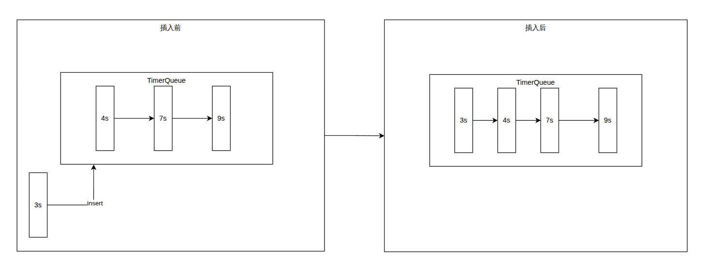

可以非常清晰的理解，不同插入时间会对计时器的到期提示造成不同的影响，那么如果插入了一个更早的时间，就应该让插入时间的函数意识到，需要重置计时器的到期提醒，以防定时事件的延误，所以earliestChanged的作用就在于此。

那么resetTimerfd函数的作用已经清晰了，就是重置计时器的到期提醒时间。具体流程见下面的定义

```cpp
void TimerQueue::resetTimerfd(Timestamp when) {
  int64_t microseconds = when.microSecondsSinceEpoch() - Timestamp::now().microSecondsSinceEpoch();
  if (microseconds < 100)
    microseconds = 100;

  itimerspec newValue{};
  newValue.it_value.tv_sec = static_cast<time_t>(microseconds / 1000000);
  newValue.it_value.tv_nsec = static_cast<long>((microseconds % 1000000) * 1000);
  // 设置下一次触发时刻，flags 置 0 表示相对时间，如果需要绝对时间则置 TFD_TIMER_ABSTIME
  ::timerfd_settime(timerfd_, 0, &newValue, nullptr);
}
```

核心就在于调用timerfd_settime让timerfd_知道接下来多久之后会触发到期事件（即使得fd可读）。

那么既然已经理清了添加计时器的流程，接下来就需要知晓如何取消一个计时器任务，首先是给外界调用的方法void cancel

```cpp
void TimerQueue::cancel(TimerId timerId) {
  loop_->runInLoop([this, timerId]() { cancelInLoop(timerId); });
}
```

取消指定TimerId的任务，根据定义会交由TimerQueue所处的EventLoop线程执行线程内取消。

不过通过这个函数的定义，我们理清了一个addTimer返回TimerId句柄的作用，即当队列希望取消某个任务时，就可以通过TimerId进行取消，那么之前TimerId设计意义不明的原因，应该也能在cancelInLoop中寻求到答案，接下来让我们看看这个函数的详细定义

```cpp
void TimerQueue::cancelInLoop(TimerId timerId) {
  auto it = activeTimers_.find(timerId.sequence_);
  // 校验指针，防止 sequence 复用（ABA 问题）
  if (it != activeTimers_.end() && it->second == timerId.timer_) {
    size_t n = timers_.erase(Entry(it->second->expiration(), it->second));
    assert(n == 1);
    // void(n) 用于显式忽略未使用的变量，避免编译器警告
    (void)n;
    delete it->second;
    activeTimers_.erase(it);

  }  // 配合handleRead中的callingExpiredTimers_
  else if (callingExpiredTimers_) {
    // 此定时器已被 getExpired 移出索引，但仍在 expired 列表里、其回调正在栈上执行。
    // 不能在此 delete：callback_ 存在 Timer 内部，删了就是 use-after-free；
    // 故只登记 sequence，由 reset() 统一销毁（跳过重新入队）。
    cancelingTimers_.insert(timerId.sequence_);
  }
}
```

那么就会冒出一个想法，本质上也只是拿取timers对应的timerId，那么直接让用户拿着Timer的指针，然后传入不就好了，还省去一层封装？

但将Timer的指针给用户这样的设计真的好吗？显然不行！

- 第一：裸指针暴露给用户，就会出现一个致命的问题，如果一不小心用户那边delete了，那么访问Timer的时候就会出现访问错误。
- 第二：持有Timer的引用的用户可以自由的调用run、repeat等函数，造成时间队列的混乱。

所以我们要对用户隐藏这个数据结构，让用户无法调用其中的任何方法，所以采用了TimerId的设计，同时把Timer的指针和sequence序号都放到private下，只允许指定的友元类访问，这样就达成了隐藏实现细节，防止用户误操作，同时又可以让用户可以获得一个用来取消定时任务的句柄。

 至此Timer部分的细节说明完成，接下来就是将这部分嵌入到项目中，将其放入EventLoop的结构中，即

```cpp
TimerId EventLoop::runAt(Timestamp time, TimerCallback cb) {
  return timerQueue_->addTimer(std::move(cb), time, 0.0);
}

TimerId EventLoop::runAfter(double delay, TimerCallback cb) {
  Timestamp time = Timestamp::now() + static_cast<int64_t>(delay * 1000000);
  return runAt(time, std::move(cb));
}

TimerId EventLoop::runEvery(double interval, TimerCallback cb) {
  Timestamp time = Timestamp::now() + static_cast<int64_t>(interval * 1000000);
  return timerQueue_->addTimer(std::move(cb), time, interval);
}
```

可以让某个任务在一个时间点触发、在一段时间后触发一次或多次。

至此定时任务设计完成。


### 1.1 基于计时器的连接超时关闭（TimingWheel）

思考一个简单的问题，当一个连接<u>既没有发送关闭信号也没有发送任何数据</u>，那么这个连接将会永久持续下去，永久占用内存空间，增加epoll的监听负担。

那么最直觉的做法，应该是给每个连接都挂一个定时器，借助前面写好的`TimerQueue`，连接建立时就注册一个"N秒后关闭"的任务，每收到一次数据就把旧的`cancel`掉、再重设一个新的，似乎也能解决问题。不过别急，这样真的好吗？显然不够好。

- 第一：假设有十万个活跃连接，就有十万个定时器常驻在`timers_`这棵红黑树里，内存和维护的负担都不小。
- 第二：每来一个数据包都要做一次`cancel + addTimer`，也就是两次`std::set`的增删（O(log n)），高频场景下相当浪费。

退一步想，我们对超时的精度要求其实很粗——"大约N秒没动静就关掉"，<span style="color:darkorange">差个一两秒根本无所谓</span>。既然如此，又何必为这点精度付出这么大的代价呢？所以连接超时机制就这么轻而易举的被考虑到了，这就是接下来要讲的**时间轮（TimingWheel）**。

```cpp
class TimingWheel{
    private:
    struct Entry {
        public:
        explicit Entry(const std::weak_ptr<TcpConnection>& weakConn);
        ~Entry();
        public:
        std::weak_ptr<TcpConnection> weakConn_;  ///< 对所管理连接的弱引用。
    };
    using EntryPtr     = std::shared_ptr<Entry>;
    using WeakEntryPtr = std::weak_ptr<Entry>;
    using Bucket = std::unordered_set<EntryPtr>;
    EventLoop* loop_;             ///< 所属事件循环。
    int timeoutSeconds_;          ///< 空闲超时秒数，等于 buckets_ 的长度。
    std::deque<Bucket> buckets_;  ///< 时间轮主体，队首最老、队尾最新。
    std::unordered_map<std::string, WeakEntryPtr> connEntries_;  ///< connName → Entry 弱引用。
};
```

也许刚刚看到这个设计的时候会觉得莫名奇妙，又是`Entry`，又是把`shared_ptr<Entry>`塞进`Bucket`，`Entry`里面还套着一个`weak_ptr<TcpConnection>`，到底为什么要绕这么多层？那么就让我一点点拆解这一系列的内容。

先看整体骨架，`buckets_`是一个`deque<Bucket>`，一开始就分配好`timeoutSeconds`个格子，每个格子（`Bucket`）代表"一秒"这个时间片，<span style="color:dodgerblue">队首是最老的一秒，队尾是最新的一秒</span>。

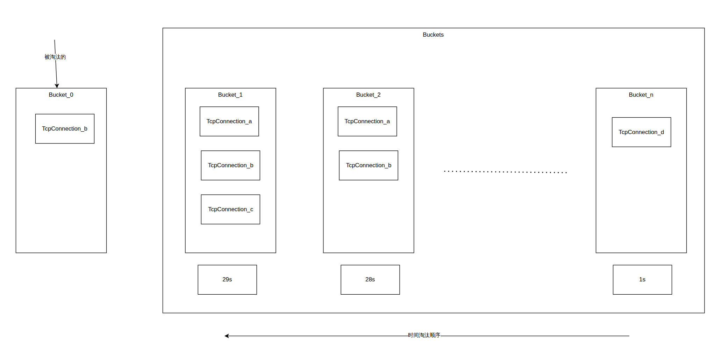

这样一个Buckets的运转逻辑，一个`Bucket`对应的数个同时刻活跃的TcpConnection的对象指针，<u>每间隔一定时间段</u>就会淘汰一个Bucket（所有其中的TcpConnection智能指针自动析构），同时加入一个新的Bucket（此时激活的TcpConnection放入），这样就可以在TcpConnection<span style="color:dodgerblue">无需任何设计</span>的情况下自动完成Tcp连接的淘汰、刷新等操作。就像传送带一样，传送带不断向一个方向滚动，末位的Bucket被丢下（淘汰）其中的货物也消失，与此同时一个新的Bucket被放上来，并将此时有的货物（TcpConnection）放入。

知晓基础的工作原理后，再回过头看那几层包裹，就能逐渐理解它们各自的职责了。

```cpp
struct Entry {
    public:
    explicit Entry(const std::weak_ptr<TcpConnection>& weakConn);
    ~Entry();
    public:
    std::weak_ptr<TcpConnection> weakConn_;  ///< 对所管理连接的弱引用。
};
```

先看最里面`Enrty`的`weak_ptr<TcpConnection>`。要意识到时间轮的角色仅仅是个"监督者"，连接真正的所有权在`TcpServer`、`TcpConnection`那一套体系里。<u>如果这里用的是`shared_ptr`</u>，那么时间轮反而会延长连接的寿命，甚至和连接互相持有形成<span style="color:crimson">循环引用</span>，导致谁都析构不了。所以这里用`weak_ptr`，表达的是"我只是看你还活着没有，并不掌控你的生死"。

再看`Entry`，它的全部精髓就在那个**析构函数**上，`Entry`一旦析构，就尝试`weakConn_.lock()`，连接若还活着就调用`forceClose()`关掉它。换句话说，<span style="color:dodgerblue">"关闭连接"这个动作被巧妙地绑定到了`Entry`对象销毁的那一刻</span>。

```cpp
TimingWheel::Entry::~Entry() {
  auto conn = weakConn_.lock();  // weak_ptr 尝试升为 shared_ptr
  if (conn) {
    conn->forceClose();          // 连接还活着，踢掉它
  }
  // lock() 返回空说明连接已经被其他路径关闭，什么都不用做
}
```

```cpp
using Bucket = std::unordered_set<EntryPtr>;
```

最后是装进`Bucket`里的`shared_ptr<Entry>`，它用引用计数来表达"这个连接还能再活多久"。同一个`Entry`可以同时被放进好几个格子，<span style="color:dodgerblue">只要还有任意一个格子持有它，引用计数就不归零，`Entry`就不析构，连接也就不会被关闭</span>。

到这里，"刷新超时"为什么轻量也就清楚了，收到数据时只要把同一个`shared_ptr<Entry>`再塞进当前最新的那个格子即可，这样它的引用计数+1，等最老的格子滑到队首被丢弃时，<u>引用计数只是从2降到1而不是归零</u>，`Entry`照样活着，连接得以续命，超时计时也就从这一刻重新开始。

不过这里又会冒出一个问题，`onMessage`是怎么快速找到"这个连接对应的那个`Entry`"的呢？一个直觉的做法是把`weak_ptr<Entry>`反向塞进`TcpConnection`自身——`TcpConnection`预留了一个`std::any context_`口袋，调用方可以往里塞任意类型的业务数据，底层对里面放了什么一无所知。但<u>这样时间轮就独占了应用层唯一的那个口袋</u>，之后`HttpServer`需要存 HTTP 解析状态、`WsServer`需要存帧解码状态，便无处落脚，<span style="color:crimson">传输层组件不该侵占应用层的资源</span>。

因此更干净的做法是让`TimingWheel`自己维护一份内部索引：以`conn->getName()`为 key、`WeakEntryPtr`为 value，塞进`connEntries_`，查找是 O(1) 哈希，`context_`则完整地留给上层：

```cpp
// ❌ 旧方式：占用了应用层唯一的 context_ 口袋
conn->setContext(std::weak_ptr<Entry>(entry));

// ✅ 新方式：TimingWheel 自己维护索引，context_ 原封不动
connEntries_[conn->getName()] = WeakEntryPtr(entry);
```

这样`HttpServer`存 HTTP 解析上下文、`WsServer`存帧解码状态，都可以自由使用`conn->setContext()`，时间轮不再与应用层争抢同一个槽位。

理清这些，接下来逐个拆解实现就很顺了，首先是构造函数：

```cpp
TimingWheel::TimingWheel(EventLoop* loop, int timeoutSeconds)
    : loop_(loop), timeoutSeconds_(timeoutSeconds), buckets_(timeoutSeconds) {
  // 注册每秒触发一次的定时器，驱动时间轮向前滑动
  loop_->runEvery(1.0, [this] { onTimer(); });
}
```

可以看到，<span style="color:dodgerblue">整个时间轮自始至终只用了一个真正的定时器</span>，即`runEvery(1.0, ...)`注册的这个每秒触发的回调，它负责驱动传送带向前滚动一格，同时`buckets_(timeoutSeconds)`预先分配好了对应数量的空格子。对比开头那个"每连接一个定时器"的方案，差距一目了然。

接下来看新连接建立时调用的`onConnection`：

```cpp
void TimingWheel::onConnection(const TcpConnectionPtr& conn) {
  auto entry = std::make_shared<Entry>(conn);
  buckets_.back().insert(entry);
  connEntries_[conn->getName()] = WeakEntryPtr(entry);
}
```

逻辑很直白，给新连接造一个`Entry`，放进最新的格子（队尾），再把对应的`WeakEntryPtr`以连接名为 key 存入`connEntries_`，供之后刷新超时时查找。

然后是收到数据时调用的`onMessage`：

```cpp
void TimingWheel::onMessage(const TcpConnectionPtr& conn, Buffer*, Timestamp) {
  auto it = connEntries_.find(conn->getName());
  if (it == connEntries_.end()) return;
  auto entry = it->second.lock();
  if (entry) {
    buckets_.back().insert(entry);
  }
}
```

先按连接名在`connEntries_`里查一次，查不到说明连接已断开直接返回；查到后`lock()`取出`EntryPtr`，插进队尾最新格，就完成一次续命。这里用`unordered_set`做格子也是有讲究的，它<u>天然去重</u>，所以同一秒内连续收到多个数据包也不会重复插入同一个`Entry`。

连接主动断开或被踢出后，`connEntries_`里的那条记录不会自动消失，需要显式清理，这就是`onClose`的职责：

```cpp
void TimingWheel::onClose(const TcpConnectionPtr& conn) {
  connEntries_.erase(conn->getName());
}
```

它在`TcpServer`连接回调检测到`isConnected()`为假时触发，把 map 里的 key 直接抹掉。就算此时对应的`Entry`引用计数还未归零，`connEntries_`里存的本就是`WeakEntryPtr`，erase 不影响`Entry`的生命周期；反过来若`Entry`已经析构，`onClose`也只是空跑一次 erase，两者互不干扰。

这三个函数在`TcpServer::newConnection`里统一串起来，把时间轮的逻辑包裹在用户回调的外面：

```cpp
// TcpServer::newConnection（节选）
auto wheel = wheels_[ioLoop];
conn->setConnectionCallback(
    [wheel, cb = connectionCallback_](const TcpConnectionPtr& c) {
      if (c->isConnected()) wheel->onConnection(c);  // 新连接：注册 Entry
      else                  wheel->onClose(c);        // 连接断开：清理 map
      if (cb) cb(c);                                  // 再回调用户逻辑
    });
conn->setMessageCallback(
    [wheel, cb = messageCallback_](const TcpConnectionPtr& c, Buffer* buf, Timestamp ts) {
      wheel->onMessage(c, buf, ts);  // 先刷新超时计时
      if (cb) cb(c, buf, ts);        // 再交给用户处理数据
    });
```

注意顺序：时间轮的操作总在用户回调**之前**执行，确保 Entry 状态在用户代码跑之前已经就位。

真正推动传送带前进的，是每秒触发的`onTimer`：

```cpp
void TimingWheel::onTimer() {
  buckets_.push_back(Bucket());
  buckets_.pop_front();
}
```

短短两行，队尾追加一个新空格，队首弹出最老的格。关键就在`pop_front`，它会销毁整个最老的`Bucket`，<u>而里面那些引用计数已经归零的`Entry`，就在这一刻随之析构</u>。

而`Entry`的析构函数，正是前面反复提到的那个"扳机"：

```cpp
TimingWheel::Entry::~Entry() {
  auto conn = weakConn_.lock();
  if (conn) {
    conn->forceClose();
  }
}
```

那么最后还剩一个问题，`forceClose`究竟做了什么。`Entry`的析构发生在`onTimer`里，本就运行在所属的IO线程，不过为了和项目里"跨线程操作一律通过`runInLoop`派发"的约定保持一致，`forceClose`同样把真正的关闭逻辑封进了`forceCloseInLoop`，定义如下：

```cpp
void TcpConnection::forceClose() {
  if (state_ == StateE::kConnected || state_ == StateE::kDisconnecting) {
    state_ = StateE::kDisconnecting;
    loop_->runInLoop([self = shared_from_this()]() { self->forceCloseInLoop(); });
  }
}

void TcpConnection::forceCloseInLoop() {
  handleClose();
}
```

这里有个细节值得留意，<u>lambda按值捕获了`shared_from_this()`</u>，这就保证了从"决定关闭"到"真正执行关闭"的这段时间里，连接对象不会被提前析构。而最终它复用的正是前文[连接关闭流程](#连接关闭流程)里讲过的`handleClose()`，完成`channel_`摘除、回调通知、资源回收这一整套动作，这里不再赘述。除此之外还配套提供了`forceCloseWithDelay`，把`runInLoop`换成`runAfter`，就实现了"延迟若干秒后再强制关闭"。

至此，时间轮把"N秒空闲超时"这件事，从"每连接一个定时器、高频增删红黑树"压缩成了全局仅一个每秒定时器、新增与刷新都是O(1)哈希插入，而连接何时关闭则完全交给`shared_ptr<Entry>`的引用计数自动驱动，<span style="color:dodgerblue">`TcpConnection`本身零侵入，`context_`口袋也完整留给了应用层</span>。使用时只需把`onConnection`/`onMessage`/`onClose`分别挂到`TcpServer`对应的回调即可。回过头再看那三层包裹，其实每一层都在精确地解决一个问题，`weak_ptr<TcpConnection>`防循环引用，`Entry`把关闭绑定到析构，`shared_ptr<Entry>`用引用计数表达存活窗口，理解了这三者的配合，整个超时机制也就豁然开朗了。
